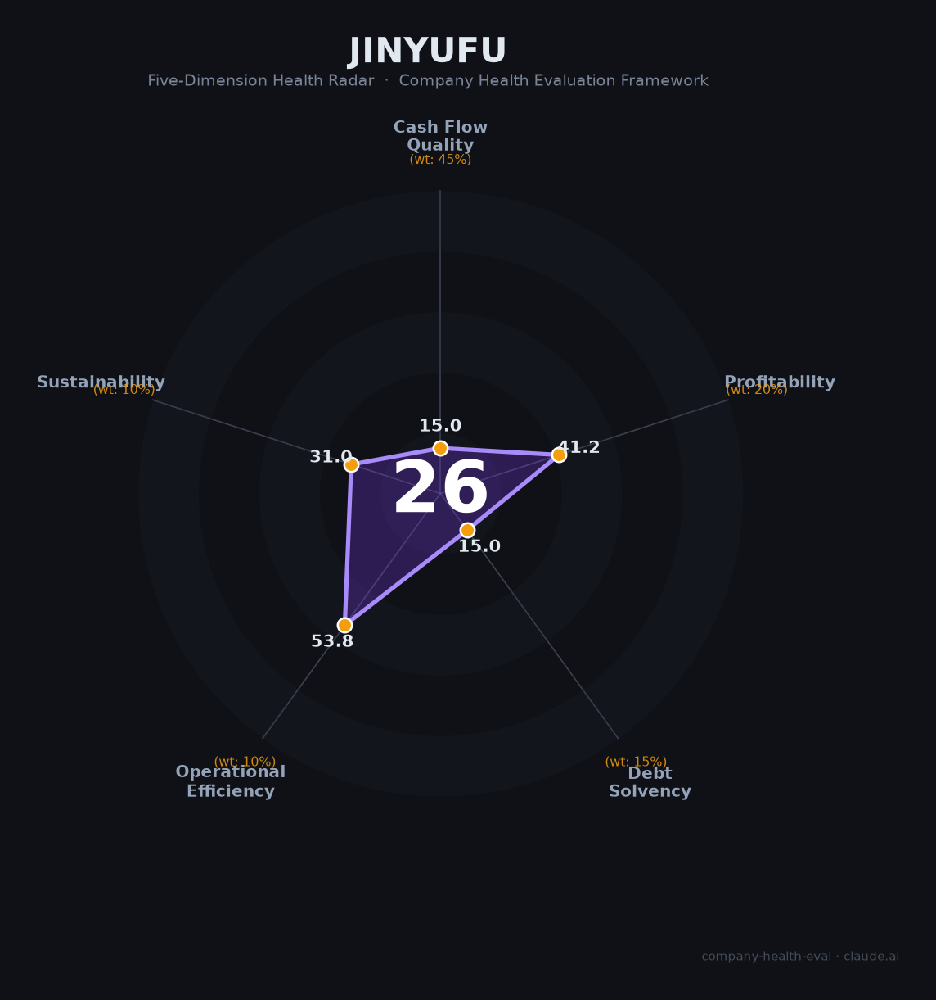

# 金雅福控股集团财务健康评估（2026-08-13）

## 一句话结论
⚫ **高风险（32/100）** | 黄金珠宝/供应链民企——黄金"委托购销"理财爆雷70-80亿+资金链断裂+欠薪，重大信用事件

## 一、公司基本画像
| 主体 | 🔒 深圳市金雅福控股集团，非上市民企；黄金珠宝/供应链 |
| 主营 | 黄金珠宝、供应链、金融 |
| 风险 | ⚠️ 2025年末"黄金委托购销"理财爆雷70-80亿、资金链断裂、欠薪；负债率约56%、员工1466 |

## 二、五维
### 1. 现金流（15/100）危险：爆雷+资金链断裂+欠薪
### 2. 盈利（41/100）关注：营收561亿但净利率0.5%、净利2.8亿（薄）
### 3. 偿债（15/100）危险：爆雷/负债/流动性断裂
### 4. 运营（54/100）关注：黄金供应链重资产
### 5. 可持续（31/100）危险：信用崩塌、经营难以为继

## 三、综合
| 15|45%=6.8 | 41|20%=8.2 | 15|15%=2.2 | 54|10%=5.4 | 31|10%=3.1 | **32** |
**评级：⚫ 高风险** — 理财爆雷+资金链断裂，生存存疑

## 四、风险
1. 黄金理财爆雷70-80亿。
2. 资金链断裂+欠薪。
3. 信用崩塌、经营难以为继。

## 五、求职
- 优势：黄金珠宝/供应链规模。
- 短板：爆雷+欠薪+生存存疑。

**结论**：重大信用与经营风险，强烈不建议作为雇主，需规避。

---
*评估方法：商泰汽车（iAUTO）五维框架 · 来源媒体/中国500强财报，非上市核实有限*