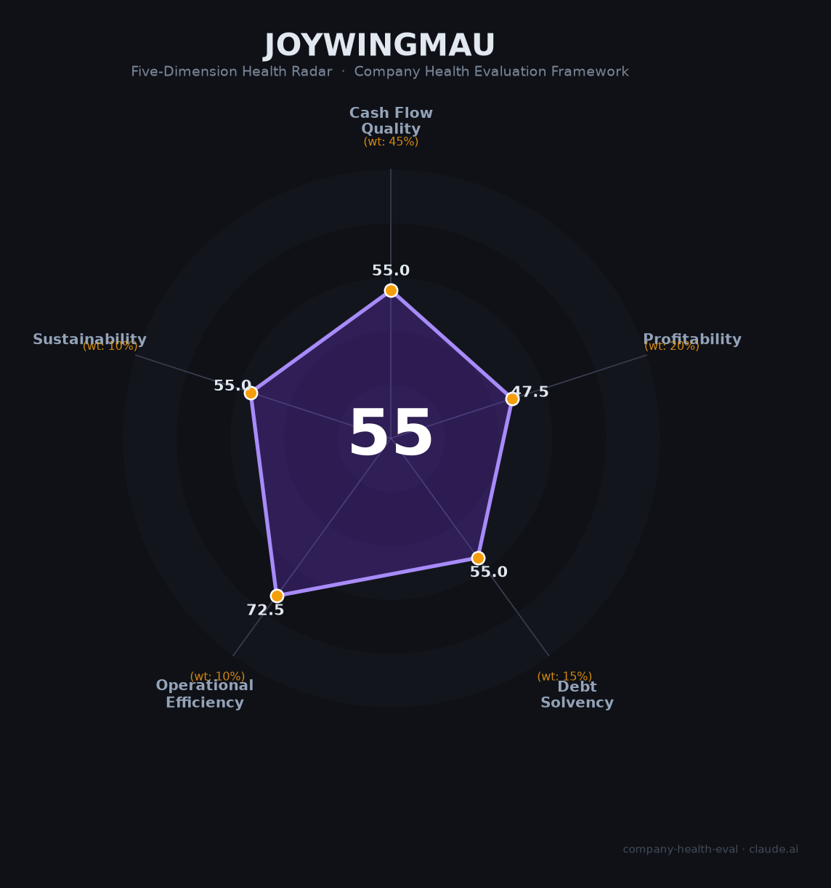

# 鑫荣懋（—（拟IPO））财务健康评估（2026-08-13）

## 一句话结论

🟠 **55/100，中等** | 水果供应链龙头，规模大但净利率极薄

## 一、公司基本画像

| 项目 | 内容 |
|------|------|
| 主体 | 鑫荣懋果业科技集团，水果供应链龙头 |
| 主营 | 全球水果采购/分销/零售 |
| 财务 | 2025营收约200亿，净利约3.2亿，净利率约1.6% |

> 一句话定性：水果供应链龙头，营收大但净利率极薄

---

## 二、五维财务健康评估

### 1. 现金流质量（55/100）| 权重45%

供应链企业现金流尚可，但毛利薄、净现比一般。

### 2. 盈利能力（48/100）| 权重20%

毛利率与净利率都偏低，盈利承压。

### 3. 偿债能力（55/100）| 权重15%

负债率偏高，流动比率一般。

### 4. 运营效率（72/100）| 权重10%

应收/存货周转压力大。

### 5. 可持续发展（55/100）| 权重10%

水果消费稳定，公司全渠道布局，但有种植/价格风险。

---

## 三、综合评分

| 维度 | 得分 | 权重 | 加权 |
|------|:----:|:----:|:----:|
| 现金流质量 | 55 | 45% | 24.8 |
| 盈利能力 | 48 | 20% | 9.5 |
| 偿债能力 | 55 | 15% | 8.2 |
| 运营效率 | 72 | 10% | 7.2 |
| 可持续发展 | 55 | 10% | 5.5 |
| **综合得分** | **55/100** | 100% | 55.2 |

**健康等级：中等** — 整体稳健，局部有待改善

---

## 四、核心风险清单

1. **净利率极薄、利润波动大**
2. **水果价格与损耗风险**
3. **客户(山姆/永辉)相对集中**
4. **IPO尚未落地、数据透明度低**

## 五、求职/择业视角

### 核心优势
- 水果行业龙头、全渠道平台、规模优势
### 现有短板
- 净利率极薄、非上市透明度低、盈利波动大

**结论**：鑫荣懋水果供应链龙头规模大，但净利率极薄、盈利与透明度有限，需谨慎评估。

---

*评估方法：商泰汽车（iAUTO）五维框架 · 数据截至2026年8月 · 财务来源联想控股披露/招股书*