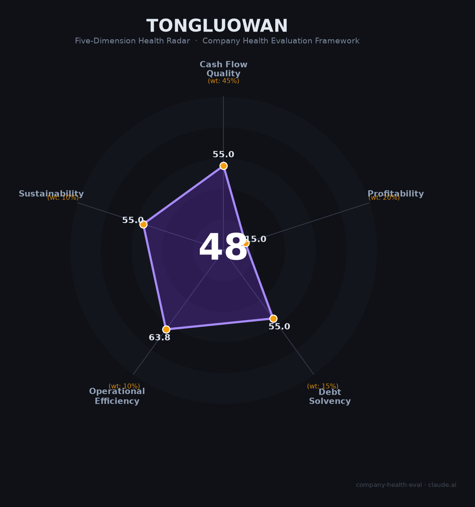

# 铜锣湾商业发展财务健康评估（2026-08-13）

## 一句话结论
🔴 **中等偏下（48/100）** | 港澳独资商业地产——铜锣湾广场连锁，体量小数据有限，评估存不确定性

## 一、公司基本画像
| 主体 | 🔒 深圳市铜锣湾商业发展，港澳独资商业地产 |
| 主营 | 铜锣湾广场/商业地产连锁 |
| 财务 | ⚠️ 小微企业/非上市，不披露 |

## 二、评估
商业地产（铜锣湾广场）：商业地产/运营体量小，数据有限。
## 三、综合（48，🔴 中等偏下）
数据有限不确定。

## 四、风险
1. 非上市小微、数据不可核实。
2. 商业地产下行。

## 五、求职
- 短板：体量小、不透明。**需尽调，非首选。**

---
*评估方法：商泰汽车（iAUTO）五维 · 数据有限*