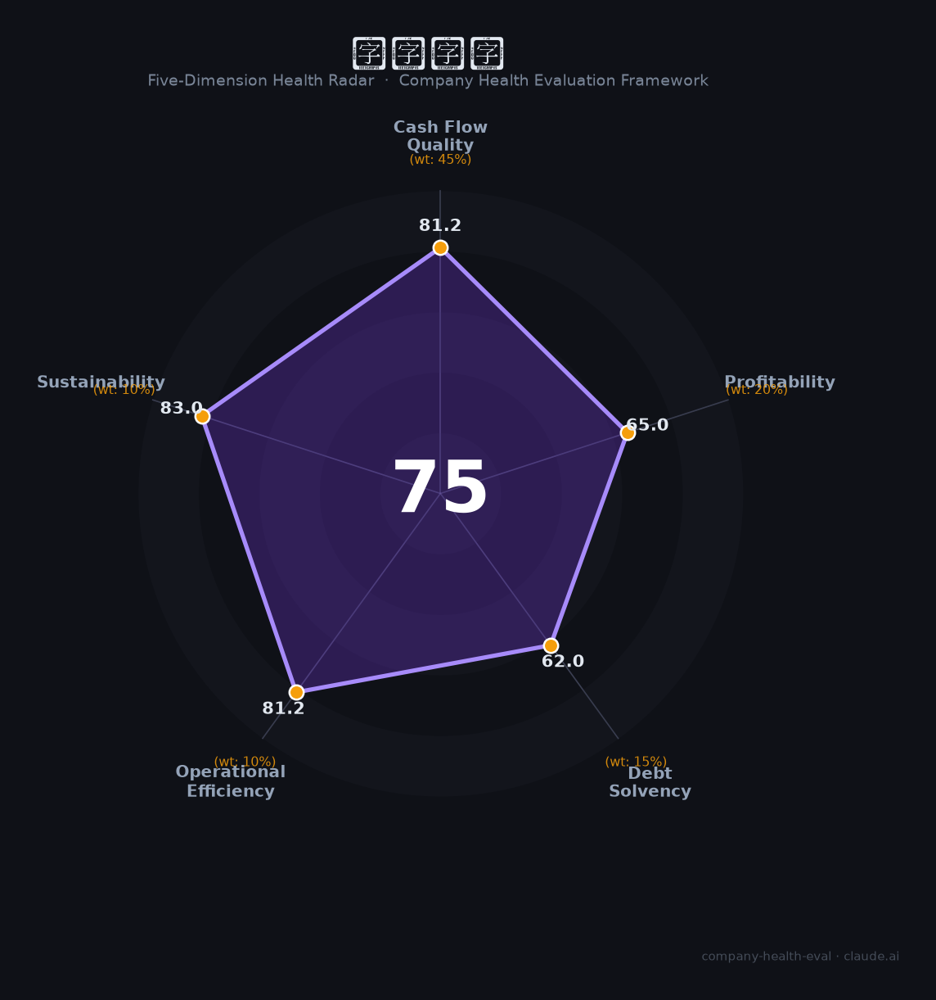

# 长城开发（000021.SZ）财务健康评估（2026-08-14）

## 一句话结论

🟡 **75/100，中等偏上** | 存储与高端制造，营收净利双增、央企稳健

---

## 一、公司基本画像

| 项目 | 内容 |
|------|------|
| 主体 | 长城开发(深科技)，存储/高端制造 |
| 主营 | 存储/计量/电子制造EMS |
| 财务 | 2025营收157.5亿，归母净利11.36亿(+22%) |

> 一句话定性：存储+高端制造，营收净利双增、央企背景

---

## 二、五维财务健康评估

### 1. 现金流质量（81/100）| 权重45%

现金流稳健。

### 2. 盈利能力（65/100）| 权重20%

存储周期好转，净利改善。

### 3. 偿债能力（62/100）| 权重15%

负债适中。

### 4. 运营效率（81/100）| 权重10%

运营效率良好。

### 5. 可持续发展（83/100）| 权重10%

存储/半导体国产化+央企背景，成长可期。

---

## 三、综合评分

| 维度 | 得分 | 权重 | 加权 |
|------|:----:|:----:|:----:|
| 现金流质量 | 81 | 45% | 36.5 |
| 盈利能力 | 65 | 20% | 13.0 |
| 偿债能力 | 62 | 15% | 9.3 |
| 运营效率 | 81 | 10% | 8.1 |
| 可持续发展 | 83 | 10% | 8.3 |
| **综合得分** | **75/100** | 100% | 75.3 |

**健康等级：中等偏上** — 整体稳健，局部有待改善

---

## 四、核心风险清单

1. **存储周期波动**
2. **客户集中**
3. **制造毛利低**

## 五、求职/择业视角

### 核心优势
- 存储+制造、央企、成长
### 现有短板
- 存储周期、客户集中

**结论**：长城开发(深科技)存储+高端制造，营收净利双增、央企背景，稳健且具成长性。

---

*评估方法：商泰汽车（iAUTO）五维框架 · 数据截至2026年8月 · 财务来源深科技2025年报*