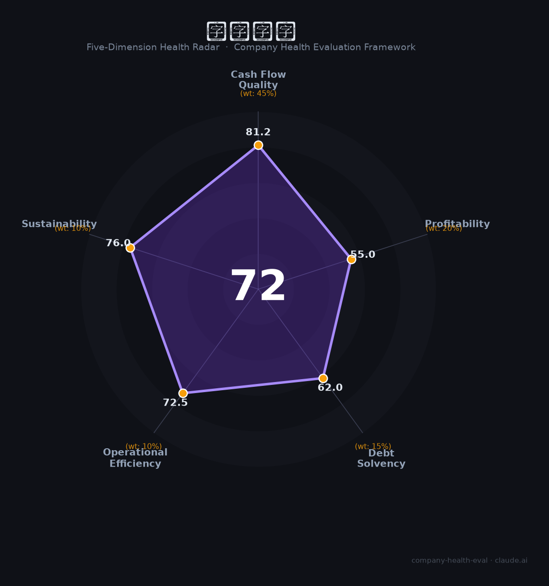

# 长盈精密（300115.SZ）财务健康评估（2026-08-14）

## 一句话结论

🟡 **72/100，中等偏上** | 精密制造龙头，消费电子稳健、机器人带来新增

---

## 一、公司基本画像

| 项目 | 内容 |
|------|------|
| 主体 | 长盈精密，精密零组件龙头 |
| 主营 | 消费电子精密结构件/机器人零部件 |
| 财务 | 2025营收188.19亿，扣非净利5.7亿，双增 |

> 一句话定性：消费电子精密件龙头，出海+人形机器人成长

---

## 二、五维财务健康评估

### 1. 现金流质量（81/100）| 权重45%

经营现金流良好。

### 2. 盈利能力（55/100）| 权重20%

净利率偏薄但改善。

### 3. 偿债能力（62/100）| 权重15%

负债平稳。

### 4. 运营效率（72/100）| 权重10%

运营效率良好。

### 5. 可持续发展（76/100）| 权重10%

消费电子+新能源+人形机器人多维成长，海外占比高。

---

## 三、综合评分

| 维度 | 得分 | 权重 | 加权 |
|------|:----:|:----:|:----:|
| 现金流质量 | 81 | 45% | 36.5 |
| 盈利能力 | 55 | 20% | 11.0 |
| 偿债能力 | 62 | 15% | 9.3 |
| 运营效率 | 72 | 10% | 7.2 |
| 可持续发展 | 76 | 10% | 7.6 |
| **综合得分** | **72/100** | 100% | 71.7 |

**健康等级：中等偏上** — 整体稳健，局部有待改善

---

## 四、核心风险清单

1. **消费电子需求波动**
2. **毛利率承压**
3. **大客户依赖**

## 五、求职/择业视角

### 核心优势
- 精密制造龙头、机器人概念、海外占比高
### 现有短板
- 净利率偏薄、消费电子周期

**结论**：长盈精密精密制造龙头，消费电子稳健+机器人打开成长空间，整体稳健向上。

---

*评估方法：商泰汽车（iAUTO）五维框架 · 数据截至2026年8月 · 财务来源长盈精密2025年报*