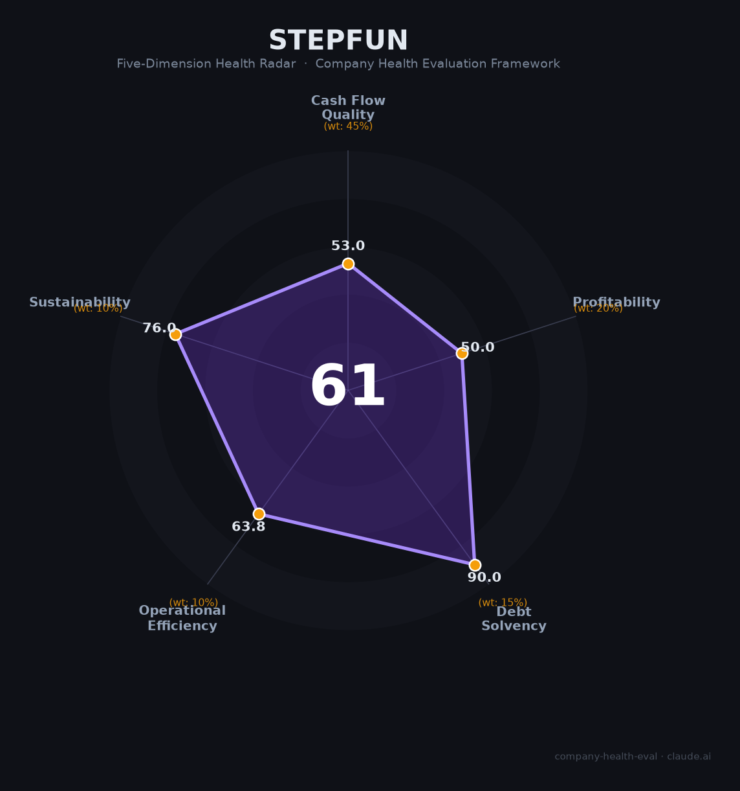

# 阶跃星辰（StepFun）财务健康评估（2026-06-12）

## 一句话结论

🔴 **中等偏下 · 综合得分 61/100** | Agent基础设施赛道定位独特——Step 3.7 Flash以400 Tokens/s全球最快Agent推理速度、ClawEval 67.1超越DeepSeek V4 Flash。手机装机4200万台+车载100万辆目标提供终端分发壁垒。但年营收仅5亿元、PS 140-170x、印奇旷视历史包袱（累计亏损150亿+IPO五年未果）、财务完全不透明——这是一家「技术方向极其正确，但商业化和治理风险双高」的Pre-IPO独角兽。

---

## 一、公司基本画像

| 项目 | 详情 |
|------|------|
| **运营主体** | 上海阶跃星辰智能科技股份有限公司，2023年4月成立 |
| **CEO/创始人** | 姜大昕（前微软全球副总裁、微软亚洲互联网工程院首席科学家） |
| **董事长** | 印奇（旷视科技联合创始人，2026年1月出任） |
| **总部** | 上海徐汇区漕河泾开发区 |
| **员工规模** | 超400人，研发占比约80% 📊 |
| **上市状态** | 未上市，已秘密向港交所递表，目标2026年底上市；Pre-IPO估值约100-120亿美元 💬 |
| **融资历史** | B轮(2024.12)数亿美元→B+轮(2026.01)超50亿元→Pre-IPO(2026.05)近25亿美元；累计超220亿元 📊 |
| **核心产品** | Step系列大模型（Step 3.7 Flash Agent速度全球第一）、阶跃AI、AgentOS |
| **2025年营收** | 近5亿元人民币；2026年目标约12亿元 📊 |
| **装机量** | 手机超4,200万台（覆盖60%头部品牌）、车载目标100万辆+ 📊 |

**一句话定性**：阶跃星辰是大模型"六小虎"中战略最聚焦Agent基础设施的公司——不做C端烧钱获客，而是把模型嵌入手机/汽车终端的系统操作层。Step 3.7 Flash在Agent场景下速度全球第一（400 Tokens/s）、ClawEval超越DeepSeek。但年营收仅5亿、印奇（旷视亏150亿+）出任董事长带来治理复杂性、秘密递表前财务完全不透明，是典型的「战略方向极具前瞻性，但估值已提前透支」的Pre-IPO公司。

---

## 二、五维财务健康评估

### 1. 现金流质量（52/100）🔴 | 权重45%

| 评估指标 | 状态 | 判断 | 依据 |
|----------|------|------|------|
| 经营现金流 | 未公开披露 | ⚠️ 未知 | 未上市前无公开财务数据 |
| 融资现金 | B+轮50亿 + Pre-IPO约170亿 = **超220亿元**累计融资 | 🟢 极充裕 | 📊 多源确认。2026年5月刚完成$2.5B Pre-IPO轮 |
| 营收规模 | 约5亿元（2025年），目标12亿（2026年） | 🔴 极小 | 📊 年营收仅为估值的1/140-1/170 |
| 现金跑道 | 若年均烧钱10-15亿（按400人×80%研发估算），跑道约15-20年 | 🟡 理论充裕 | 📊 但实际烧钱速度未知（算力+研发成本） |

**本维度分析**：阶跃星辰的现金流高度依赖融资输血——累计220亿+融资使其短期内无生存危机，但年营收仅5亿意味着经营造血能力几乎为零。财务完全黑箱（无公开报表），真实的现金消耗速度无从验证。

**扣分项**：营收极小（5亿 vs 估值$100亿+）（-25分）；经营现金流完全未知（-15分）；财务黑箱（-10分）。

---

### 2. 盈利能力（50/100）🔴 | 权重20%

| 评估指标 | 状态 | 判断 | 依据 |
|----------|------|------|------|
| 营收规模 | 约5亿元（2025年），同比增速估约150%+ | 🟡 早期高增长 | 📊 基数极小，增速参考意义有限 |
| 毛利率 | 未公开 | ⚠️ 未知 | 端侧License收费毛利较高，云侧API毛利较低 |
| 亏损 | 必然深度亏损 | 🔴 确定亏损 | 📊 400人×80%研发+大模型训练成本 vs 5亿收入 |
| PS估值比 | $100-120亿估值/5亿营收 ≈ **140-170x** | 🔴 极端高估 | 📊 即使按2026E营收12亿，PS仍达60-70x |

**本维度分析**：阶跃星辰在盈利能力维度评分极低——不是在"赚钱少"，而是"完全没有证明能赚钱"。5亿年营收对应100亿美元估值，其隐含假设是未来3-5年营收需增长20-30倍。虽然有手机装机4200万台的终端分发优势，但从装机到付费的转化率仍未公开验证。

**扣分项**：营收绝对规模极小（-25分）；PS 140-170x极高（-20分）；无盈利时间表（-15分）。

---

### 3. 偿债能力（90/100）🟡 | 权重15%

| 评估指标 | 状态 | 判断 | 依据 |
|----------|------|------|------|
| 现金储备（估算） | B+轮50亿+Pre-IPO 170亿+历史融资 ≈ **200亿+** | 🟢 充裕 | 📊 最新一轮$2.5B 2026年5月刚完成 |
| 投资方阵容 | 腾讯、上国投、港投公司(HKIC)、浦东创投、五源等 | 🟢 顶级 | 📊 产业资本+政府基金全覆盖 |
| IPO计划 | 已秘密递表港交所，目标2026年底上市 | 🟢 即将打通 | 💬 多源确认。若成功将再募约$5亿 |
| 负债 | 未披露，推测无大额有息负债 | 🟢 健康 | 📊 初创公司特征 |

---

### 4. 运营效率（63/100）🟠 | 权重10%

| 评估指标 | 状态 | 判断 | 依据 |
|----------|------|------|------|
| 人均创收 | 约125万元/人（5亿/400人） | 🟡 中等 | 📊 在AI初创中属中等水平 |
| 终端装机效率 | 400人→4200万台装机+车载100万辆目标 | 🟢 高效 | 📊 小团队撬动大分发 |
| 高管治理 | 印奇(董事长)+姜大昕(CEO)双头模式 | 🟠 复杂 | 📊 印奇同时管理旷视/千里/阶跃三家 |
| 战略聚焦 | 2025年关停C端产品"冒泡鸭"，全面转向Agent | 🟢 果断 | 📊 不做烧钱获客，专注终端Agent |

---

### 5. 可持续发展（76/100）🟠 | 权重10%

| 评估指标 | 状态 | 判断 | 依据 |
|----------|------|------|------|
| Agent技术壁垒 | Step 3.7 Flash ClawEval 67.1（超DeepSeek V4 Flash 7.3pp），400 Tokens/s | 🟢 全球领先 | 📊 公开发布的开源基准测试 |
| 终端分发壁垒 | 4200万台手机+车载100万辆+覆盖60%头部品牌 | 🟢 独特 | 📊 其他大模型公司不具备的端侧入口 |
| 印奇"三方拼图" | 阶跃(大脑)+千里(躯干)+吉利(产业) = Physical AI | 🟠 有待验证 | 📊 生态叙事宏大但执行复杂度极高 |
| 竞争窗口 | 智谱/MiniMax已抢先上市；月之暗面/百川追赶 | 🟠 收窄 | 📊 港股大模型IPO窗口可能在2026年底关闭 |
| 印奇历史包袱 | 旷视累计亏损150亿+，IPO五年未果 | 🔴 信任折扣 | 📊 投资人对其商业化能力存疑 |

---

## 三、综合评分与健康等级

| 维度 | 得分 | 权重 | 加权得分 |
|------|:----:|:----:|:--------:|
|现金流质量| 52 |45%| 23.4 |
|盈利能力| 50 |20%| 10.0 |
|偿债能力| 90 |15%| 13.5 |
|运营效率| 63 |10%| 6.3 |
|可持续发展| 76 |10%| 7.6 |
| **61/100** |**—**|**100%**|**60.80**|

**健康等级**：🟠 **中等（Moderate）** — Agent基础设施战略方向极其正确、Step 3.7 Flash技术指标全球领先、终端分发壁垒独特。但年营收仅5亿、PS 140-170x、财务黑箱、印奇治理复杂性构成多重风险。

---

## 四、求职/择业视角

### 核心优势
- **Agent方向极致匹配**：match score 91（全JSONL最高之一），MCP/Tool Call/Agent架构直接对口
- **上海漕河泾**：通勤便利
- **技术团队顶级**：CEO姜大昕（前微软VP）、张祥雨（ResNet作者）、朱亦博（前字节AI Infra负责人）
- **Pre-IPO阶段**：即将港股上市，期权潜在回报空间大
- **战略方向前瞻**：Agent基础设施+终端嵌入是AI落地最确定的路径之一

### 核心短板
- **财务完全不透明**：入职前无法评估公司真实烧钱速度和跑道
- **印奇治理风险**：一人管理三家公司（旷视/千里/阶跃），精力分散
- **旷视阴影**：印奇前作旷视亏150亿+IPO失败的历史影响投资人信心
- **营收极小**：5亿年营收无法支撑100亿美元估值，若IPO后股价破发，期权价值将大幅缩水
- **组织规模小**：400人+，职业发展天花板明显

### 推荐度：🟡 适合对Agent基础设施方向有极强信念、能接受Pre-IPO高不确定性的技术人才。

---

*评估日期：2026-06-12 | 数据截至：2026年6月公开报道和行业估算*

> ⚠️ 阶跃星辰未上市，财务数据完全未公开。营收/估值等均为媒体报道估算。
