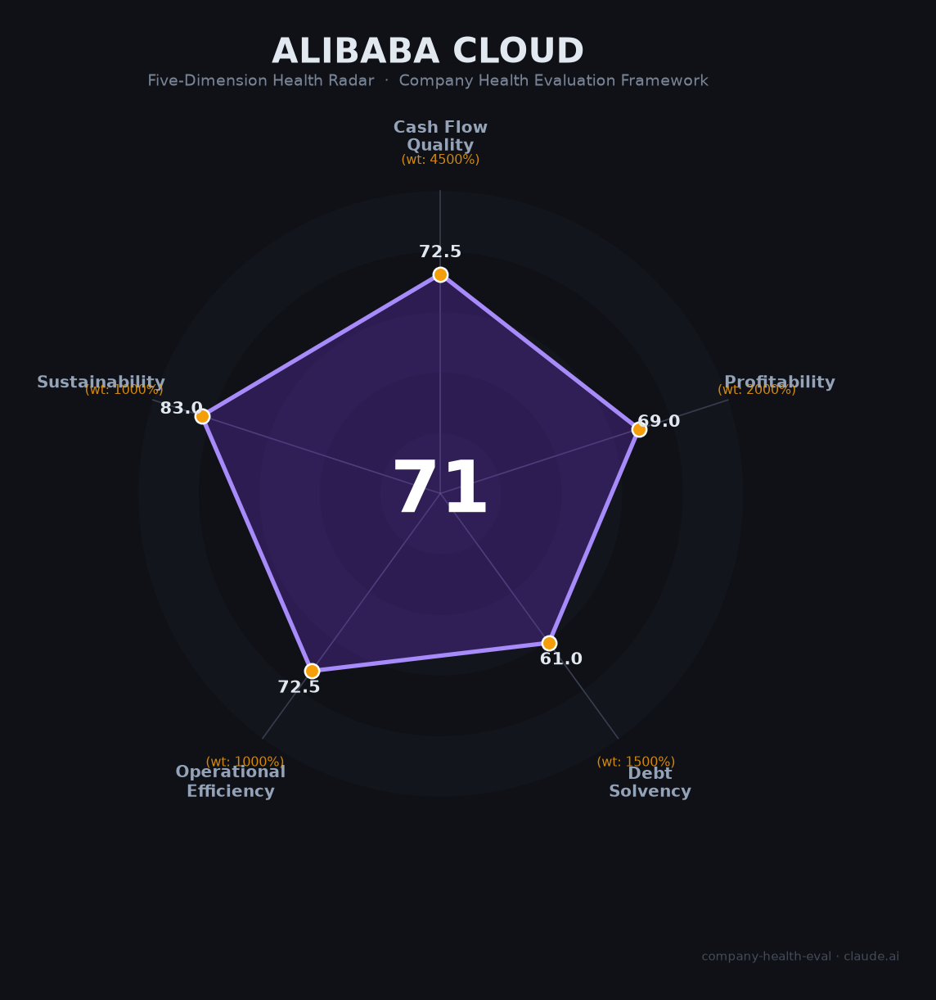

# 阿里巴巴（阿里云）财务健康评估（2026-06-12）

## 一句话结论

🟡 **中等偏上（71.1/100）** | AI云增长引擎强力·FCF转负短期承压·地缘芯片双风险

---

## 一、公司基本画像

| 维度 | 详情 |
|------|------|
| 主体 | 阿里巴巴集团控股有限公司（BABA/9988.HK） |
| 成立 | 1999年（马云创立） |
| CEO | 吴泳铭（Eddie Wu，2023年9月起） |
| FY2026营收 | ¥1.02万亿（+2.7%，可比口径+11%） |
| FY2026净利润 | ¥1036亿（-20.4%） |
| FY2026经营现金流 | ¥762亿（-53.4%） |
| 净现金 | +¥2391亿（全球科技公司中最强之一） |
| 员工 | ~13.1万人（经剥离高鑫零售/银泰后触底回升） |
| 云业务 | 阿里云：中国市场份额37%（#1），AI云38.1%（#1），FY2026 Q4增速40% |
| 上市 | NYSE: BABA / HKEX: 9988.HK，市值约$3020亿 |
| 关注岗位 | 百炼Agent开发工程师、AI Agent开发平台资深技术专家 |

**一句话定性**：中国最大电商+云计算的巨无霸，正以每年超¥1200亿AI资本开支推动"全栈Agent化"转型。云业务增速40%和AI ARR超¥800亿是最大亮点，但集团FCF转负（-¥499亿）、股价较峰值跌65%、Pentagon 1260H列名构成短期主要压力。

---

## 二、五维财务健康评估

### 1. 现金流质量（72.5/100）

经营现金流在FY2026大幅下滑53%至¥762亿，主要因AI基础设施投入激增和营运资金变动。自由现金流更是首度转负至-¥499亿，为至少5年来首次。

但净现金头寸高达+¥2391亿（🔒SEC 20-F年报），D/E仅25%，财务结构极为保守。3年¥3800亿AI资本开支计划意味着FCF在中期内将持续承压，但现金储备足以覆盖。OCF/NI比率从1.30x降至0.75x，质量有所下降但仍在安全范围。

### 2. 盈利能力（69.0/100）

| 指标 | 数据 | 评级 |
|------|------|------|
| 毛利率 | 39.8%（FY2026） | 良好 |
| 净利率 | 10.35%（GAAP） | 良好 |
| 营收增速 | 3年CAGR 5.6%（可比口径~11%） | 一般 |
| 研发费用率 | 6.5%（¥665亿） | 良好 |
| 人均产出 | ~¥779万/年 | 良好 |

FY2026 GAAP净利润下降20%，非GAAP净利润下降62%，主要受累于¥951.5亿商誉减值"财务洗澡"和即时零售/AI投入大增。云业务EBITA利润率仅9%，但与AWS早期路径相似——规模效应有望在未来2-3年推动利润率向15-20%收敛。淘天集团EBITA利润率41%仍是集团现金牛。

### 3. 偿债能力（61.0/100）

- **资产负债率**：41.0%（🔒年报）——处于关注区间，但含大量经营性负债
- **有息负债率**：14.8%（仅¥2817亿带息债务 vs ¥1.9万亿总资产）
- **流动比率**：1.28（关注）——流动性偏紧
- **现金比率**：0.28（危险）——单纯现金不足以覆盖流动负债
- **股权质押**：无（软银已基本清仓，🔒多家媒体报道）

净现金+¥2391亿是最大安全垫。信用评级维持投资级（穆迪A1/惠誉A+）。流动性偏紧主要源于大量现金被配置为短期投资（非现金等价物），实际短期偿付能力无忧。

### 4. 运营效率（72.5/100）

| 指标 | 评估 | 说明 |
|------|------|------|
| 应收周转 | 健康 | DSO仅12天，电商+云订阅模式天然优势 |
| 客户集中度 | 健康 | 千万级商家+数十万企业客户，极度分散 |
| 员工趋势 | 关注 | 从20.4万降至13.1万（-36%），虽以剥离为主，但核心团队也在优化 |
| 高管稳定性 | 关注 | Qwen技术负责人林俊阳+后训练负责人于博文2026年3月离职，已从Google DeepMind引进接任者 |

员工触底回升（+7000人），招聘聚焦AI/云方向。吴泳铭高度集权（兼集团CEO+阿里云CEO+淘天CEO+技术委员会组长），战略执行效率高但关键人集中度上升。

### 5. 可持续发展能力（83.0/100）

| 指标 | 评估 | 说明 |
|------|------|------|
| 行业赛道 | 健康 | AI云市场CAGR>25%，Agent市场107%增长，电商稳中有升 |
| 技术壁垒 | 健康 | Qwen全球50%+开源下载量、20万+衍生模型、#1 HuggingFace，自研真武M890芯片 |
| 业务多元化 | 健康 | 电商41%+云11%+国际化12%+物流9%+本地生活6%，多引擎驱动 |
| 资本支持 | 健康 | NYSE+HKEX双重上市、A1/AA-信用评级、¥2391亿净现金、股票回购计划 |
| 政策风险 | 关注 | 2026年6月Pentagon 1260H列名、芯片出口管制、电商监管趋严（618约谈） |

**核心优势**：Qwen开源生态压倒性领先（下载量超#2-#9总和）、真武M890芯片已出货56万片（国产AI芯片第二）、阿里云全栈Agent化重构从芯片到模型到云到平台实现闭环。

---

## 三、综合评分与健康等级

| 维度 | 得分 | 权重 | 加权得分 |
|------|------|------|----------|
| 现金流质量 | 72.5 | 45% | 32.6 |
| 盈利能力 | 69.0 | 20% | 13.8 |
| 偿债能力 | 61.0 | 15% | 9.2 |
| 运营效率 | 72.5 | 10% | 7.2 |
| 可持续发展 | 83.0 | 10% | 8.3 |
| **综合得分** | | **100%** | **71.1** |

**健康等级**：🟡 中等偏上（Moderate-High）

---

## 四、同业对标

| 对比项 | **阿里巴巴** | 腾讯 | 华为 | 亚马逊AWS |
|--------|-------------|------|------|-----------|
| 上市/代码 | BABA/9988.HK | 0700.HK | 未上市 | AMZN |
| 市值 | ~$3020亿 | ~$4500亿 | — | ~$2.2万亿 |
| 营收（FY2026） | ¥1.02万亿 | ¥7000亿+ | ¥8600亿+ | $6380亿 |
| 云市场份额（中国） | 37%（#1） | ~10%（#3） | 17%（#2） | 中国<5% |
| AI云份额 | 38.1%（#1） | ~8-10% | ~15-17% | — |
| 云增速 | +40%（Q4） | — | — | +18%（AWS全球） |
| 净利率 | 10.35% | ~18% | ~8% | ~9% |
| 净现金头寸 | +¥2391亿 | 强 | — | — |
| 核心AI模型 | Qwen开源生态 | 混元 | 盘古 | Nova/Bedrock |

**对标结论**：阿里云在中国云+AI市场断层领先，Qwen开源生态全球第一。与腾讯比规模更大、增速更高；与华为比AI生态更开放、开发者基础更强。核心短板在于芯片自给率仍低（依赖NVIDIA）和盈利能力被AI军备竞赛暂时拖累——类似AWS 2015-2018年的投入期。

---

## 五、核心风险清单

1. **FCF转负与AI烧钱（中高）**：FY2026自由现金流-¥499亿，3年¥3800亿AI资本开支计划意味着FCF至少到FY2028才能转正。若AI商业化不及预期，投资回报周期将被拉长。

2. **美国1260H清单与芯片管制（高）**：2026年6月Pentagon将阿里列入中国军事企业清单（1260H），虽非出口管制实体清单，但被广泛视为更严厉限制的前奏。真武M890已出货56万片，但单芯片性能仍不及NVIDIA H200，完全国产替代至少需2-3年。

3. **股价持续低迷（中）**：BABA股价较2020年峰值跌65%，RSU激励效果大打折扣。2026年6月单日跌5.4%（618约谈+1260H双重打击），市场情绪脆弱。

4. **Qwen核心人才流失（中低）**：技术负责人林俊阳（阿里最年轻P10）和后训练负责人于博文2026年3月同时离职。虽已从Google DeepMind引入接任者，但万亿参数模型的核心know-how转移需要时间。

5. **核心电商份额承压（中）**：拼多多和抖音电商持续蚕食市场份额。中国消费疲软（2026年1-4月零售增速仅1.9%）进一步压缩增长空间。

6. **钉钉文化争议（低）**：2026年6月《置身钉内》事件暴露了阿里内部管理问题。合伙人委员会罕见下场纠偏，表明自愈机制仍在运转，但"包装优先于实干"的深层文化问题非一朝一夕可解。

---

## 六、求职/择业视角

### 核心优势

- **AI战略优先级最高**：CEO吴泳铭亲自挂帅，成立ATH事业群整合通义/百炼/悟空等全部AI力量。AI岗位是集团最安全、增长最快的方向。
- **技术栈顶级**：Qwen开源生态全球第一、自研真武M890芯片、百炼Agent平台ARR超¥80亿、日均Token调用量行业前列。在AI基础设施层面的经验几乎无可替代。
- **薪酬行业前段**：AI岗P7年包91-150万（溢价20-30%），顶尖人才可达500万+。阿里云年度奖金曾达8-12倍月薪。
- **品牌背书强**：阿里云/AI岗位经历在跳槽时高度溢价。字节、腾讯、华为均积极从阿里云挖人（字节P9曾出现4倍年薪挖角案例）。

### 现存短板

- **工作强度第一梯队**：阿里云核心团队12-14小时/天。百炼和Qwen团队处于"战时状态"。钉钉《置身钉内》事件揭示了007文化的极端案例。
- **361考核文化**：虽官方宣称取消强制361，但多数团队反映以某种形式实质上仍存在。末位10%面临无年终奖或无涨薪的风险。
- **RSU价值不确定性**：股价较峰值跌65%，新入职RSU的潜在价值高度取决于未来股价走势。地缘政治风险（1260H清单）进一步增加了波动性。
- **管理"包装文化"**：老员工普遍反映"向上管理比实际产出更重要"——技术导向的工程师可能水土不服。

### 分场景建议

| 个人诉求 | 推荐 | 次选 | 规避 |
|----------|------|------|------|
| AI技术深度+平台经验 | 阿里云（Qwen/百炼） | 字节豆包 | 非核心业务线 |
| 高现金薪酬 | 字节跳动（现金占比高） | 阿里云（RSU不确定性大） | — |
| WLB+稳定 | 腾讯云 | 阿里云（非核心产品线） | 阿里云核心AI团队 |
| Agent/LLM方向成长 | 阿里云百炼平台 | DeepSeek、智谱AI | 电商/物流等传统业务 |

---

## 七、总结

**阿里巴巴（阿里云）是中国唯一实现"芯片→模型→云→Agent平台"全栈闭环的科技巨头，AI/云业务以40%增速驱动集团转型，Qwen开源生态全球第一、自研真武M890芯片位居国产第二、百炼Agent平台ARR爆发式增长。但¥3800亿AI军备竞赛致FCF转负、1260H地缘清单和芯片管制构成供给侧最大风险、股价低迷压缩RSU激励效果。对于Agent/AI方向的求职者，阿里云是积累"AI基础设施全栈经验"的顶级平台——但需接受高强度工作节奏和RSU波动带来的薪酬不确定性。**

适合：追求AI基础设施全栈经验、愿意用高强度换取技术深度、相信阿里云AI战略执行力的工程师。
不适合：追求WLB、对RSU依赖度高且风险承受力低、不适应大厂"361+包装文化"的求职者。

---

*评估日期：2026-06-12 | 数据截至：FY2026（2026年3月） | 评分引擎：score.py v1.1 | 信息来源：SEC 20-F、港交所公告、阿里云峰会、IDC/Omdia、脉脉/知乎等行业渠道*
