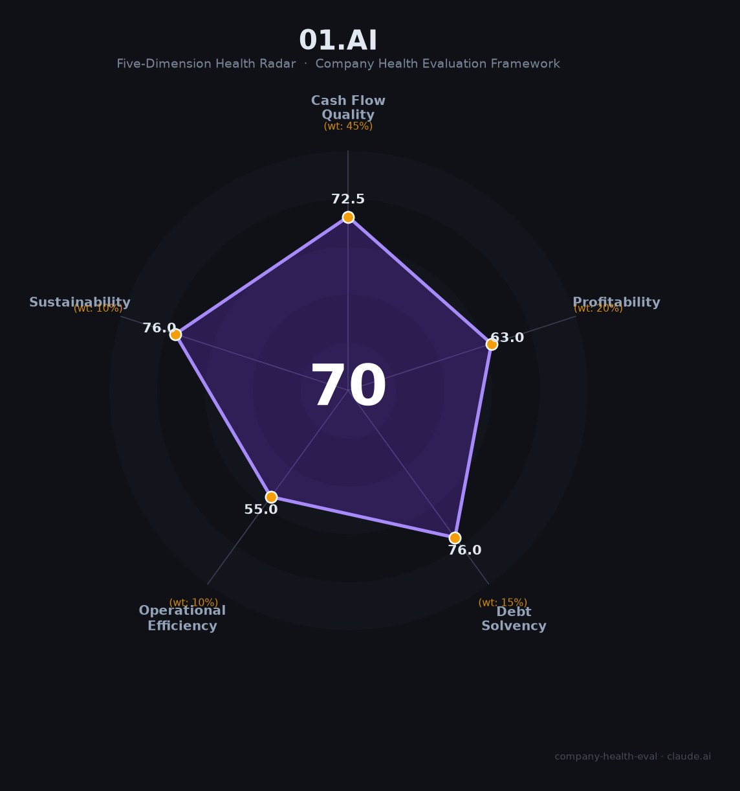

# 零一万物 财务健康评估（2026-06-12）

## 一句话结论

🟠 **中等（69.7/100）** | 人效极高（人均营收125万）、近盈亏平衡（六小虎中财务最健康）、万智2.5企业Agent平台独特；唯6位联创离职+依赖DeepSeek等开源基座模型是核心脆弱点

---

## 一、公司基本画像

| 项目 | 内容 |
|------|------|
| **全称** | 北京零一万物科技有限公司（01.AI） |
| **成立** | 2023年5月16日，北京 |
| **创始人/CEO** | 李开复（前Google全球副总裁/微软全球副总裁/创新工场创始人，AI领域40年） |
| **员工** | ~200人（2026年5月），研发占比~89% |
| **主营业务** | 企业级多智能体平台"万智2.5"+深度Agent定制+合资共创 |
| **2025年营收** | 2.5亿元（经审计），合同订单5亿元 |
| **2026年订单** | 超15亿元（截至5月，近半为ARR经常性收入） |
| **估值** | ~104亿元（2024年8月A轮） |
| **融资总额** | 天使轮+ A轮约$7-15亿美元（阿里云领投） |
| **IPO计划** | 2027年港股交表，正拆除红筹架构 |
| **核心客户** | 中国移动、顺丰、阿里云、中国电信、华为、正大集团（合资公司"万蜂智能"） |

零一万物是"大模型六小虎"中唯一全面转向企业级AI Agent平台的公司。放弃万亿参数超大基座模型自研后，以年运营成本仅2亿多元的极简模式，创造了2.5亿经审计营收（行业第二仅次于智谱AI），且距离盈亏平衡咫尺之遥。李开复拒绝"六小虎"标签自称"金钱豹"——对标美国Palantir，聚焦产业AI落地。

---

## 二、五维财务健康评估

### 1. 现金流质量（72.5/100）

| 指标 | 状态 | 详情 |
|------|------|------|
| 经营现金流净额 | ⚠️ 关注 | 近盈亏平衡（成本2亿+ vs 收入2.5亿），尚未稳定实现正向OCF |
| 现金及等价物 | ✅ 健康 | 融资数亿美元+年运营成本仅2亿+，现金可支撑数年。2026年15亿订单中有近半为预付费ARR |
| 有息负债 | ✅ 健康 | 零有息负债，纯股权融资驱动 |
| 净现比 | ⚠️ 关注 | 尚未实现净利润，无法计算有效净现比 |

零一万物是六小虎中现金管理最克制的公司——年运营成本仅2亿多元（远低于智谱AI的31.8亿研发支出），2025年营收2.5亿已近乎覆盖成本。相比百川智能一年烧10亿却几乎无营收的窘境，零一等奖金的利用效率在六小虎中最为出色。

### 2. 盈利能力（63.0/100）

| 指标 | 等级 | 详情 |
|------|------|------|
| 毛利率 | 🌟 卓越 | 估算50-70%（📊），万智平台订阅60-80%+定制Agent 40-60%。不烧预训练算力是关键成本优势 |
| 净利率 | ⚠️ 预警 | 仍处亏损但近盈亏平衡。2026年目标单季度盈利——将成为"中国首家盈利AI 2.0公司" |
| 营收增速 | 🌟 卓越 | 2024年1亿→2025年2.5亿（+150%）。2026年5月订单已15亿元，同比数倍增长 |
| 研发费用率 | ⚠️ 预警 | ~80%+且亏损（AI创业公司早期特征），但绝对值极低（2亿/年） |
| 人均产出 | 🌟 卓越 | 125万元/人（2.5亿/200人），远超六小虎同行（智谱36万、MiniMax 37万） |

人均产出125万是六小虎中的绝对第一——智谱AI约36万/人（7.24亿/2000人），MiniMax约37万/人（5.6亿/1500人）。零一万物以200人创造了相当于智谱AI 35%的营收，人效是智谱的3.5倍。

### 3. 偿债能力（76.0/100）

零有息负债+充裕现金+VC强力背书（阿里云领投），偿债风险极低。两"关注"仅因非上市数据不透明。

### 4. 运营效率（55.0/100）

| 指标 | 状态 | 详情 |
|------|------|------|
| 应收周转 | ⚠️ 关注 | 政企客户确收率仅约50%（2025年5亿订单→2.5亿确收），回款周期长 |
| 客户集中度 | ⚠️ 关注 | 单一能源客户占2025年营收35%。正积极分散化（2026年已服务上百客户） |
| 员工规模趋势 | ⚠️ 关注 | 从300+→低谷<200→恢复200+，2025年招聘量+121% |
| 高管稳定性 | ⚠️ 关注 | 6位联合创始人/核心高管先后离职（李先刚/黄文灏/曹大鹏/潘欣/戴宗宏/谷雪梅），2025年新团队逐步到位 |

四项全"关注"并非意外——转型期企业的运营效率天然承压。客户集中度和确收率是2026-2027年最需改善的指标。

### 5. 可持续发展能力（76.0/100）

- **市场赛道**：企业级AI Agent市场CAGR 107%（2026年预计449亿），中国AI智能体市场爆发期
- **技术壁垒**：万智2.5+合资共创模式独特，但依赖DeepSeek/Qwen等开源基座模型——这是最大战略脆弱点
- **资本支持**：Pre-IPO融资推进中，2027年港股交表，对比Palantir（$2,000亿+市值）估值空间巨大

---

## 三、综合评分与健康等级

| 维度 | 得分 | 权重 | 加权得分 |
|------|:----:|:----:|:--------:|
| 现金流质量 | 72.5 | 45% | 32.6 |
| 盈利能力 | 63.0 | 20% | 12.6 |
| 偿债能力 | 76.0 | 15% | 11.4 |
| 运营效率 | 55.0 | 10% | 5.5 |
| 可持续发展 | 76.0 | 10% | 7.6 |
| **综合得分** | **69.7** | **100%** | **69.7/100** |

**健康等级：🟠 中等（Moderate）**

---

## 四、同业对标

| 对比项 | 零一万物 | 智谱AI | MiniMax | 百川智能 |
|--------|:----:|:----:|:----:|:----:|
| 2025年营收 | 2.5亿 | 7.24亿 | 5.6亿 | <1亿（估） |
| 人均营收 | **125万** | 36万 | 37万 | ~5万 |
| 年运营成本 | **2亿+** | 31.8亿（研发） | — | ~5-10亿 |
| 盈亏状态 | 近盈亏平衡 | -47亿 | -$1.9B | 深度亏损 |
| 员工数 | ~200 | ~2,000+ | ~1,500+ | ~200 |
| 战略方向 | 企业Agent+合资 | 政企MaaS基座 | C端全球化 | 医疗AI |
| 上市状态 | 2027港股计划 | 港股02513 | 港股0100 | 未上市 |
| 基座模型 | 不自研（依赖开源） | 自研GLM | 自研 | 自研M4（医疗） |

**对标结论**：零一万物在"六小虎"中的财务健康度远超同行——人效是智谱的3.5倍、百川的25倍，且是唯一接近盈亏平衡的公司。但放弃基座模型自研的战略选择，使其在技术护城河上弱于智谱和百川。

---

## 五、核心风险清单

1. **开源模型依赖（极高风险）**：全面依赖DeepSeek/Qwen等外部基座模型。一旦DeepSeek变更开源协议或阿里调整合作策略，万智平台的核心能力基础将被动摇。

2. **基座控制权丧失（高风险）**：已裁撤预训练团队并移交阿里云，丧失模型层独立性。从"AI技术公司"退化为"AI集成商"是长期估值的重大折扣。

3. **高管团队剧烈动荡（高风险）**：6位核心高管离职，2025年新团队尚待验证。对200人团队而言，核心人才流失的冲击被极度放大。

4. **客户集中度偏高（中风险）**：单一客户占营收35%，确收率仅50%。若大客户流失或政企预算削减，收入波动将显著。

5. **李开复美籍身份（中风险）**：港股IPO时VIE架构/CSRC审查/数据安全审查均可能因其美籍身份而额外加码。

---

## 六、求职/择业视角

### 核心优势
- **财务最健康的六小虎**：近盈亏平衡+15亿订单储备，破产风险远低于百川/MiniMax，期权变现前景最明确（2027年IPO目标）
- **人效极高=个人价值清晰**：200人团队支撑2.5亿营收，每个人的贡献直接可量化。"一把手工程"文化让核心员工直接对接客户CEO
- **Palantir式对标=估值空间大**：若成功复制Palantir模式（$2,000亿+市值），早期员工股权回报极为可观

### 现存短板
- **基座模型不掌握=技术天花板低**：深耕Agent应用层的工程师经验在"模型为王"时代可能被低估
- **李开复个人色彩过重**：公司=李开复品牌，CEO个人风险（年龄62岁/美籍身份/过往争议）与公司高度绑定
- **期权变现不确定性**：2027年港股IPO取决于市场窗口+CSRC审批+盈利目标三重达成

### 分场景建议

| 个人诉求 | 推荐 | 次选 | 规避 |
|----------|------|------|------|
| IPO财务回报 | 零一万物（近盈利+2027 IPO） | 智谱AI（已上市，期权已变现） | 百川智能 |
| 企业Agent工程经验 | 零一万物（最纯正的企业Agent平台） | 百度千帆 | 纯C端AI公司 |
| 稳定+确定性 | 智谱AI（已上市，体系成熟） | 阿里/腾讯AI部门 | 零一万物（高管动荡） |

---

## 七、总结

零一万物是"大模型六小虎"中财务纪律最严格、商业化最务实的公司——以200人极小团队创造2.5亿经审计营收（人均125万=六小虎第一），2026年订单15亿且近半为ARR，距盈亏平衡仅一步之遥，唯一短板是放弃基座模型自研导致技术护城河依赖外部开源模型（DeepSeek/Qwen），以及6位联创离职带来的人力资本脆弱性。在中国AI从"模型竞赛"转向"产业落地"的大背景下，零一万物属于中等（69.7分），适合看好企业级AI Agent赛道、愿意赌"中国Palantir"模式、且能接受早期创业公司组织动荡的务实型求职者。对于以AI Agent为职业方向的候选人，零一万物的万智2.5平台+合资共创模式提供了目前中国市场最原生的"企业Agent全流程落地"实践——从MCP协议集成到FDE驻场部署。

---

*评估日期：2026年6月12日 | 数据截至：2026年5月李开复三周年内部讲话 | 注意：零一万物为非上市初创公司，财务数据基于李开复公开披露*
