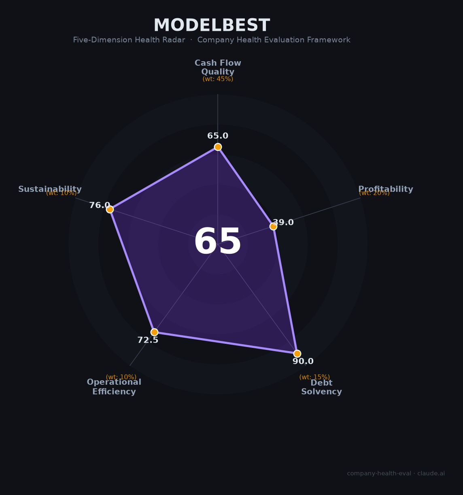

# 面壁智能（ModelBest）财务健康评估（2026-06-12）

## 一句话结论

🟠 **中等（65/100）** | 端侧大模型赛道头部创业公司，融资强劲团队稳定，但开源变现路径未验证、营收微薄高度依赖融资续命

---

## 一、公司基本画像

- **主体**：北京面壁智能科技有限责任公司，2022年8月成立，注册资本约71.3万元
- **股权结构**：曾国洋（CTO，约23.35%）+ 李大海（CEO）+ 刘知远（首席科学家）+ 北京清语启航（员工持股平台）；外部股东含华为哈勃、中国电信、深创投、茅台基金、知乎、智谱AI、春华资本等
- **规模**：社保参保147人（2024年工商年报），团队超100人，平均年龄28岁，清北密度超80%
- **主营**：MiniCPM端侧大模型系列 + AgentCPM（GUI Agent），以"密度法则"用小参数实现高性能，完全开源
- **资质**：ASPICE L2级车规认证（国内首家通过的大模型企业）、2026年度中国独角兽企业
- **融资状态**：种子轮→D+轮共8轮，累计超10亿元，2026年4月投后估值迈入独角兽门槛（超10亿美元）

**一句话定性**：清华系端侧大模型独角兽，走"小模型+端侧部署+开源生态"差异化路线，是国内端侧AI赛道融资最强、汽车落地最快的创业公司，但商业化仍处于极早期。

---

## 二、五维财务健康评估

### 1. 现金流质量（65/100）

| 指标 | 判定 | 依据 |
|------|:--:|------|
| 经营现金流净额 | 🔴 危险 | 非上市初创公司，营收微薄，研发烧钱，经营现金流几乎必然为负 |
| 现金及等价物 | 🟢 健康 | 2026年Q1单季融资超10亿元，约150人团队，保守估计现金流可支撑5年以上 |
| 有息负债 | 🟢 健康 | VC驱动型创业公司，零有息负债 |
| 净现比 | — 缺失 | 无利润数据，对早期创业公司不适用 |

**核心判断**：融资能力极强（8轮/10亿+），现金储备充足，但自身造血能力为零——这是典型VC驱动创业公司的现金流画像。好的一面是零负债、现金多；危险的一面是完全依赖外部输血。

### 2. 盈利能力（39/100）

| 指标 | 判定 | 依据 |
|------|:--:|------|
| 毛利率 | 🟡 良好 | 端侧模型授权（占收入65%）边际成本极低，毛利率估计60-80%；定制开发拉低综合毛利率 |
| 净利率 | 🔴 预警 | 营收微薄、研发烧钱，深度亏损（行业普遍状态） |
| 营收增速（3年CAGR） | 🟡 良好 | 从零起步，2款量产车+7家车企在谈，增速高但绝对值极小 |
| 研发费用率 | 🔴 预警 | AI创业公司，几乎全部支出为研发，远超35%且严重亏损 |
| 人均产出 | 🔴 预警 | 年营收估计数百万至数千万级别，147人均产远低于行业基准 |

**核心判断**：标准AI创业公司盈利画像——高毛利潜力、深度亏损、高研发投入。收入模型（每车5-10美元授权费）理论上有规模化后的盈利可能，但当前阶段营收几乎可忽略不计。

### 3. 偿债能力（90/100）

| 指标 | 判定 | 依据 |
|------|:--:|------|
| 资产负债率 | 🟢 健康 | VC驱动，资产远大于负债 |
| 有息负债率 | 🟢 健康 | 零有息负债 |
| 流动比率 | 🟢 健康 | 现金充足，短期负债极小 |
| 现金比率 | 🟢 健康 | 高现金、低流动负债 |
| 股权质押 | 🟢 健康 | 非上市公司，无股权质押 |

**核心判断**：作为VC驱动创业公司，偿债能力维度天然满分——没有债务就没有偿债压力。但这也是"甜蜜期的幻象"：一旦融资中断，现金消耗会迅速改变这一局面。

### 4. 运营效率（73/100）

| 指标 | 判定 | 依据 |
|------|:--:|------|
| 应收周转 | 🟡 关注 | B2B模式面向大型车企，议价能力弱，付款周期可能较长 |
| 客户集中度 | 🟡 关注 | 汽车业务占收入65%，仅2款量产车型，高度集中 |
| 员工规模趋势 | 🟢 健康 | 从8人→86人→147人，2026年春招持续扩招，覆盖5城市 |
| 高管稳定性 | 🟢 健康 | 三核心（李大海/刘知远/曾国洋）全部在岗，无离职记录 |

**核心判断**：团队扩张健康、高管稳定，但客户结构处于早期集中状态——这是B2B创业公司的典型阶段特征，不是危险信号但需持续关注。

### 5. 可持续发展能力（76/100）

| 指标 | 判定 | 依据 |
|------|:--:|------|
| 行业赛道空间 | 🟢 健康 | 端侧大模型市场CAGR 70%+，AI Agent市场2026年预计达620亿美元 |
| 技术壁垒 | 🟡 关注 | "密度法则"有Nature MI封面论文支撑，中文GUI Grounding 71.3%业内最高；但开源策略降低了壁垒 |
| 客户/业务多元化 | 🟡 关注 | 汽车主导（65%），虽拓展手机/司法/教育/工业，但尚在早期 |
| 融资/资本支持 | 🟢 健康 | 华为哈勃、中国电信、深创投、茅台基金等豪华投资阵容 |
| 政策/监管风险 | 🟢 健康 | 端侧路线天然合规友好，芯片出口管制反而利好国产端侧方案 |

**核心判断**：赛道选择正确（端侧AI是确定性趋势），技术路线有学术支撑，投资方阵容豪华。最大不确定性在于开源模式能否在商业化窗口关闭前跑通。

---

## 三、综合评分与健康等级

| 维度 | 得分 | 权重 | 加权得分 |
|------|:----:|:----:|:--------:|
| 现金流质量 | 65 | 45% | 29.2 |
| 盈利能力 | 39 | 20% | 7.8 |
| 偿债能力 | 90 | 15% | 13.5 |
| 运营效率 | 73 | 10% | 7.2 |
| 可持续发展 | 76 | 10% | 7.6 |
| **综合得分** | | | **65/100** |
| **健康等级** | | | 🟠 **中等（Moderate）** |

---

## 四、同业对标

| 对比项 | 面壁智能 | 智谱AI | 阶跃星辰 |
|--------|---------|--------|---------|
| 成立时间 | 2022.08 | 2019 | 2023.04 |
| 上市状态 | 未上市 | 港股02513.HK | 拟港股IPO |
| 估值 | >10亿美元 | ~6000亿港元 | 最高120亿美元 |
| 员工规模 | ~150人 | ~1,094人 | ~400人 |
| 2025年营收 | 未披露（估计极小） | 7.24亿元 | ~5亿元 |
| 盈利状态 | 深度亏损 | 深度亏损（-47亿） | 深度亏损 |
| 技术路线 | 纯端侧+开源 | 云端为主+部分开源 | 端侧+云端 |
| 融资总额 | 10亿+人民币 | 83亿+人民币 | 200亿+人民币 |
| 核心差异 | 端侧密度领先，规模最小 | 综合实力第一，已上市 | 终端装机最强（4200万台） |

**对标结论**：面壁智能是端侧大模型细分赛道的头部选手，但在AI大模型全赛道中属于第二梯队——估值、营收、团队规模均远小于智谱和阶跃星辰，差异化路线清晰但尚未转化为商业规模优势。

---

## 五、核心风险清单

1. **开源变现未验证（高）**：面壁是中国最坚决的开源大模型公司，2400万+下载量但收入微薄。"开源最大化商业利益"的论点尚未被任何盈利数字验证。如果2027年前不能实现显著收入增长，估值将承压。

2. **大厂免费端侧AI挤压（极高）**：苹果WWDC 2026将端侧推理变为免费系统能力，谷歌Gemma 4、阿里Qwen、字节豆包全面进入端侧赛道。面壁作为10亿美元估值的创业公司，面对合计年资本开支超7250亿美元的科技巨头，资源差距悬殊。

3. **融资依赖与窗口收窄（高）**：8轮融资、零自我造血。2026年AI行业一级市场融资向头部集中（OpenAI一家占全球50%+），超300家中小AI公司现金流断裂。面壁能否持续以当前节奏融资存疑。

4. **客户集中与被集成风险（中高）**：汽车业务占收入65%，仅2款量产车型。与终端用户之间隔着车企，议价能力受限，每车5-10美元的定价在巨头免费策略下面临下行压力。

5. **团队年轻经验不足（低-中）**：平均年龄28岁，清北密度高但产业经验浅。在从"实验室创业"向"规模化商业公司"转型过程中，管理和执行能力可能成为瓶颈。

---

## 六、求职/择业视角

### 核心优势
- **WLB极好**：基本不加班，9:30-18:30准时下班，弹性打卡，被员工称为"温室"
- **技术方向前沿**：端侧大模型+GUI Agent，经验可迁移至自动驾驶/机器人/智能硬件
- **团队氛围好**：mentor耐心，不考八股文，务实面试风格
- **现金薪资有竞争力**：月均38K，高于行业49%，核心算法岗年包36-96万
- **零裁员记录**：成立以来无裁员、无劳动纠纷

### 现存短板
- **品牌背书弱**：相比智谱/阶跃/字节，面壁的品牌在求职市场上知名度较低
- **期权价值不确定**：未上市、无明确IPO时间表，期权变现路径不明
- **薪酬上限有限**：相比大厂（字节P7 75-120万，拼多多18薪）和头部创业公司，总包上限偏低
- **职业天花板**：150人小公司，晋升通道有限，业务边界较窄
- **简历含金量**：部分实习生反映去大厂"刷简历"对秋招更有帮助

### 分场景建议

| 个人诉求 | 推荐 | 次选 | 规避 |
|----------|------|------|------|
| 稳定+深耕 | 智谱AI（已上市，现金流可追踪） | 阶跃星辰（规模更大） | — |
| 高薪+跳板 | 字节豆包/拼多多 | 智谱AI | 面壁（品牌偏弱） |
| 成长+融资红利 | **面壁智能（早期阶段，期权upside高）** | 阶跃星辰（临近IPO） | — |
| WLB+技术兴趣 | **面壁智能（WLB完美+前沿方向）** | 阶跃星辰（上海） | 字节（高压） |

---

## 七、总结

面壁智能是端侧大模型赛道「技术路线最清晰、融资最顺利、汽车落地最快」的清华系创业公司：核心团队稳定、现金储备充足、赛道选择正确、WLB优秀。唯一短板是开源变现路径尚未验证——2400万下载量尚未转化为可观的商业收入，完全依赖融资续命。

在端侧AI确定性爆发但巨头全面入局的大环境下，面壁智能属于**中等风险、中等回报**的选择。适合追求前沿技术方向、看重WLB、愿意用短期现金换取早期期权upside的候选人；不适合追求稳定现金流、大厂品牌背书、或高现金总包的人。

---

*评估日期：2026-06-12 | 数据来源：公开信息交叉验证，非上市财务数据为估算值*
*评分引擎：company-health-eval v1.0 | 雷达图：ModelBest_health_radar.png*
