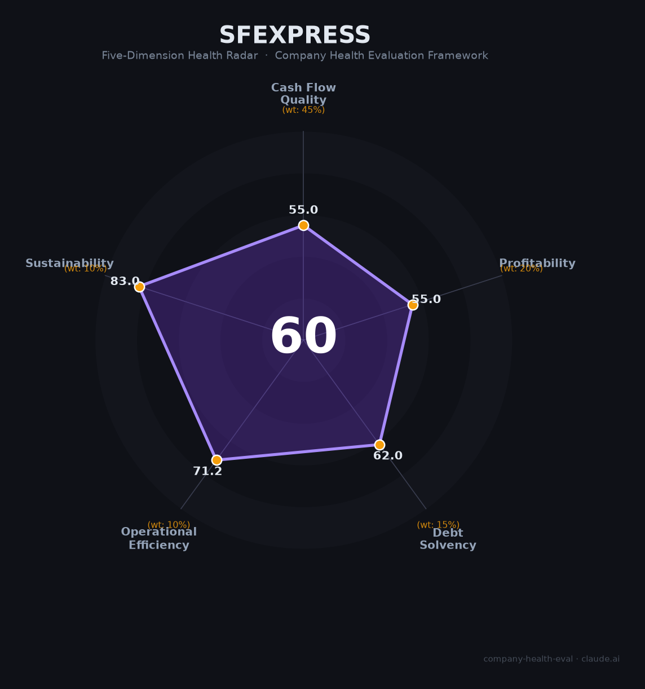

# 顺丰控股（002352.SZ / 06936.HK）财务健康评估（2026-08-13）

## 一句话结论

🟠 **中等（60/100）** | 中国物流龙头、时效快递之王——营收净利双增（+8.4%/+9.3%）+网络护城河，但毛利率下滑+应收高企+货币资金下降是核心隐忧

---

## 一、公司基本画像

| 项目 | 内容 |
|------|------|
| 主体 | 🔒 顺丰控股股份有限公司，注册深圳，A股：002352.SZ（2017借壳鼎泰新材）、H股：06936.HK（2024年）；中国最大综合物流服务商 |
| 成立 | 🔒 1993年深圳创立（王卫创业），从快递起步发展为综合物流 |
| 股权 | 🔒 创始人王卫为实际控制人，持股约63.11%（深圳明德） |
| 规模 | 🔒 员工约30万人；业务覆盖全球，拥有全货机机队；是全球第四大快递公司 |
| 主营 | 时效快递、经济快递、快运、同城急送、供应链及国际业务、冷运医药 |
| 财务 | 🔒 2025营收3,082.27亿（+8.37%），归母净利111.17亿（+9.31%），扣非92.64亿（+1.29%） |
| 盈利 | 🔒 2025毛利率13.32%（-4.37pct）、净利率3.79%；每股收益2.23元 |
| 负债 | 🔒 货币资金209.69亿（-38.21%）、有息负债365.34亿（-25.76%）、经营性现金流-14.39% |

> 一句话定性：顺丰是中国高端时效快递的代名词——自营机队+全程网络构成行业最高壁垒，客户体验与品牌溢价中国第一。但其重资产模式（毛利率13%且下滑）、应收高企（应收/净利275%）、现金流下降与短期偿债压力（货币资金/流动负债87%）是结构性隐忧。

---

## 二、五维财务健康评估

### 1. 现金流质量（55/100）| 权重45%

| 指标 | 🔒 公开数据 | 评估 |
|------|-----------|------|
| 经营现金流净额 | 2025同比下降14.39%（税费+结算节奏） | ⚠️ 关注：下降 |
| 现金及等价物 | 货币资金209.69亿（-38.21%），货币资金/流动负债87.21% | ⚠️ 关注：偏紧 |
| 有息负债 | 有息负债365.34亿（-25.76%，主动去杠杆） | ⚠️ 关注但改善 |
| 净现比/回收 | 应收/归母净利275.31%，回款压力 | ⚠️ 关注 |

**小结**：现金流质量中偏弱——2025年经营现金流同比降14.4%，货币资金大降38%（2026年回购/分红），货币资金/流动负债仅87%（<100%有短期偿债压力）。好在公司主动去杠杆（有息负债-26%），但应收高企+现金下降压制现金流质量。

> 🔒 数据来源：顺丰控股2025年年报（证券之星AI财报、搜狐、新浪财经）

### 2. 盈利能力（55/100）| 权重20%

| 指标 | 🔒 公开数据 | 评估 |
|------|-----------|------|
| 毛利率 | 13.32%（2025，-4.37pct） | ⚠️ 一般：重资产物流毛利下行 |
| 净利率 | 3.79%（2025） | ⚠️ 一般：0-5%区间 |
| 营收增速 | +8.37%（2025） | ⚠️ 一般：个位数增长 |
| 研发/科技投入 | 物流科技投入，研发费用率中低 | ⚠️ 一般 |
| 人均产出 | 3082亿/约30万人 ≈ 106万元/人 | 👍 良好：物流行业高 |

**小结**：盈利能力受重资产+价格竞争压制——毛利率13.32%（下滑4.37pct）、净利率不足4%。营收、净利双增（+8.4%/+9.3%）但仍处个位数，三费占比改善（-1.06pct）体现费用控制有效，人均产出（106万/人）在物流行业处于领先。

### 3. 偿债能力（62/100）| 权重15%

| 指标 | 🔒 公开数据 | 评估 |
|------|-----------|------|
| 资产负债率 | 物流重资产（估约50-60%） | ⚠️ 关注 |
| 有息负债率 | 有息负债365.34亿（-25.76%）| ⚠️ 关注：去杠杆中 |
| 流动比率 | 货币资金/流动负在87.21% | ⚠️ 关注 |
| 现金比率 | 货币资金209亿+，短期偿债偏紧 | ⚠️ 关注 |
| 股权质押 | 王卫少量质押 | ⚠️ 关注/健康 |

**小结**：偿债能力中等——虽然顺丰积极去杠杆（有息负债-25.76%、短期借款-53%），资产负债率在物流行业中属正常，但货币资金/流动负债87.21%（<100%）表明短期流动性偏紧，需依赖持续经营现金流入。

### 4. 运营效率（71/100）| 权重10%

| 指标 | 🔒 公开数据 | 评估 |
|------|-----------|------|
| 应收周转 | 应收账款306.07亿（+10.44%）、应收/净利275% | 🔴 危险：应收高企 |
| 客户集中度 | B2C/B2B分散，个人+企业客户 | ✅ 健康 |
| 员工趋势 | 员工约30万，稳定或微增 | ✅ 健康 |
| 高管稳定 | 创始人王卫长期掌舵 | ✅ 健康 |

**小结**：运营效率受高应收拖累（应收306亿、占净利275%反映回款慢），但客户极度分散（C端为主）、人力稳定的网络运营高效。等时达/同城布局提升运营弹性。

### 5. 可持续发展（83/100）| 权重10%

| 指标 | 🔒 公开数据 | 评估 |
|------|-----------|------|
| 行业赛道 | 中国物流/电商快递/供应链长期需求量 | ✅ 健康 |
| 技术/网络壁垒 | 全货机机队+自有机场+网络密度，壁垒极高 | ✅ 健康 |
| 多元化 | 时效/快运/同城/供应链/国际/医药，高度多元 | ✅ 健康 |
| 资本支持 | 上市AH+净资产19.7元/股 | ✅ 健康 |
| 政策/监管 | 快递行业价格战、监管 | ⚠️ 关注 |

**小结**：可持续性优秀——顺丰全网自营网络+机队构成全球级物流壁垒，多元化业务散健康发展。主要压力是快递行业价格战与单票价格下行。

---

## 三、综合评分与健康等级

| 维度 | 得分 | 权重 | 加权得分 |
|------|:----:|:----:|:--------:|
| 现金流质量 | 55.0 | 45% | 24.8 |
| 盈利能力 | 55.0 | 20% | 11.0 |
| 偿债能力 | 62.0 | 15% | 9.3 |
| 运营效率 | 71.2 | 10% | 7.1 |
| 可持续发展 | 83.0 | 10% | 8.3 |
| **综合得分** | **60/100** | **100%** | **60.5/100** |

**健康等级：🟠 中等（Moderate）** — 存在明显短板（现金流+盈利），需针对性评估。

---

## 四、同业对标

| 对比项 | 顺丰控股 | 中通快递 | 圆通速递 | 京东物流 |
|--------|:-------:|:-------:|:-------:|:-------:|
| 2025营收 | 3,082.17亿 | 505亿 | ~1,500亿 | 1,668亿 |
| 毛利率 | 13.32% | ~30% | ~9% | ~7% |
| 净利率 | 3.79% | ~25% | ~3% | ~3% |
| 模式 | 直营全网 | 加盟网络 | 加盟 | 一体化 |
| 核心差异 | 高端快件+护城河最强 | 性价比加盟之王 | 加盟网络 | 电商物流一体化 |

**对标结论**：顺丰在规模（3082亿）与高端时效壁垒上全面领先，品牌与网络优势突出；但净利润率（3.79%）显著低于中通（加盟模式轻资产净利率高）。本质是"重资产高端+全网+毛利率下行"模式，对比中通的高毛利加盟模式盈利能力偏弱。

---

## 五、核心风险清单

1. **现金流承压（中）**：经营现金流-14.39%、货币资金-38.21%、货币资金/流动负债87%<100%，短期偿债压力。
2. **应收高企（中）**：应收306亿、占归母净利275%，回款压力大。
3. **毛利率下滑（中-高）**：13.32%、同比-4.37pct，快递行业价格战压制。
4. **重资产杠杆（中）**：重资产机队/园区+租赁负债增长35%，资本开支大。
5. **行业竞争（中低）**：通达系低价竞争+京东物流等挤压。

---

## 六、求职/择业视角

### 核心优势
- **平台/品牌**：中国物流第一品牌，顺丰体系在物流圈认知极强；
- **稳定+规模**：30万人规模、业务多元，运营稳定；
- **薪酬竞争力**：顺丰在快递物流中薪酬第一梯队，管理层/科技岗位优质；
- **技术/网络**：无人机、自动化分拣、供应链科技布局。

### 现存短板
- **劳动密集+强度**：一线收派件重体力、强度大，部分岗位倒班；
- **业绩弹性**：净利率低(3.79%)，价格战压制薪酬/晋升；
- **重资产周期**：资本开支大，盈利波动。

### 分场景建议

| 个人诉求 | 推荐 | 次选 | 规避 |
|----------|------|------|------|
| 稳定+深耕 | **顺丰**（总部/科技/供应链）| 京东物流 | 小快递 |
| 高薪+跳板 | 互联网/科技大厂 | 顺丰供应链/科技 | 一线快递 |
| 物流专业+成长 | 顺丰（全网端到端） | 中通/京东物流 | 区域小驿站 |

---

## 七、总结

**顺丰是中国物流服务第一品牌——高效全网自营+机队构成全球级壁垒，作为雇主提供稳定的平台与专业成长空间。**

唯一短板是**毛利率下滑（13%+价格战）+应收与现金流承压（货币资金/流动负债87%）**——物流重资产模式盈利弹性有限，净利率仅3.79%。

在快递行业竞争加剧、单价下行的大环境下，属于**中等**风险等级，适合追求**专业物流平台+稳定规模**、进入总部/科技/供应链岗的求职者；对待遇弹性、高毛利成长性职业者而言，可更倾向一线技术或转互联网机会。

---

*评估方法：商泰汽车（iAUTO）五维企业健康度框架 · 数据截至2026年8月 · 🔒财务数据来源顺丰控股2025年年报（证券之星、官方公告、新浪财经）· 同业对标为公开市场数据*