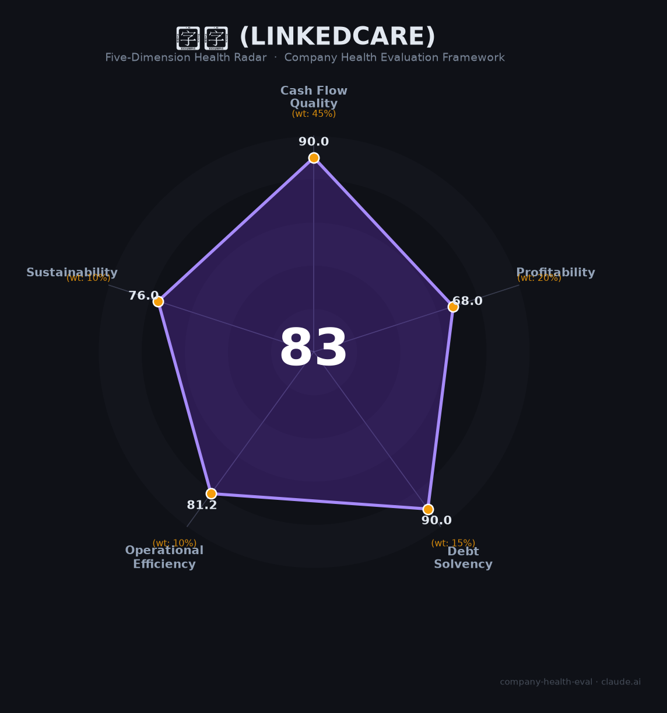

# 领健 财务健康评估（2026-06-19）

## 一句话结论

🟡 **中等偏上（83/100）** | 口腔SaaS绝对龙头+已盈利独角兽，口腔集采冲击下游+数据合规是核心隐忧

## 一、公司基本画像

| 项目 | 内容 |
|------|------|
| **运营主体** | 上海领健信息技术有限公司 |
| **品牌名** | 领健 / LinkedCare |
| **成立时间** | 2015年5月 |
| **法定代表人** | 吴志家（创始人/CEO） |
| **注册资本** | 2,503.24万元 |
| **员工规模** | 443人（社保参保），实际约500-800人 |
| **总部** | 上海张江（全国20+分支机构） |
| **融资历史** | 10轮累计超10亿人民币：天使→A轮丁香园→B轮复星→C轮泰康→D轮1亿美元（Investcorp领投）→E轮2025年1月数亿元（无锡国资） |
| **估值** | 超10亿美元（🦄 独角兽，2025年E轮后） |
| **业务模式** | SaaS订阅（e看牙+悦容医美）+ B2B耗材供应链（e看牙商城）+ 隐形正畸（悦见Linkedsmile） |
| **市场地位** | 服务5万+口腔医美机构，高端民营口腔市占率>85%，NDR 129% |

**一句话定性**：领健是中国消费医疗SaaS领域绝对龙头，已实现持续盈利（行业稀缺），通过「SaaS+供应链+自营产品」三位一体构建生态壁垒。2025年E轮引入无锡国资，估值跻身独角兽。核心风险来自下游口腔集采冲击和2025年底的数据合规事件。

## 二、五维财务健康评估

### 1. 现金流质量（90.0/100）

| 指标 | 判断 | 说明 |
|------|------|------|
| 经营现金流 | ✅ 健康 | 三大核心业务线「已实现持续盈利」（公司E轮公告），10轮融资+10年经营史 |
| 现金储备 | ✅ 健康 | 2025年1月E轮数亿人民币到账，叠加自身经营盈利积累，现金跑道充裕 |
| 有息负债 | ✅ 健康 | 无公开债务记录，纯VC股权融资路径，零有息负债运营 |

**评估**：领健是VC-backed SaaS公司的财务典范——通过股权融资而非债务驱动增长，核心业务已实现自我造血。现金流质量是本报告得分最高的维度。

### 2. 盈利能力（68.0/100）

| 指标 | 判断 | 说明 |
|------|------|------|
| 毛利率 | ✅ 良好 | 📊 综合估35-55%（SaaS部分60-70%但耗材供应链拉低），高于中国SaaS行业均值55-60%中位 |
| 净利率 | 📊 一般 | 公司称「持续盈利」但规模有限，📊 推测净利率低个位数，在普遍亏损的医疗SaaS中已属稀缺 |
| 营收增速 | ✅ 优秀 | SaaS+30%（2024）、隐形正畸+241%、商城年增100%+，整体增速远超20%门槛 |
| 研发费用率 | ✅ 良好 | 研发团队超300人，估占营收25-35%，属科技公司健康区间 |
| 人均产出 | 📊 一般 | 📊 估60-75万元/人（3-6亿/500-800人），属SaaS行业中等水平 |

**评估**：领健的增长指标亮眼（SaaS+30%、正畸+241%），已实现盈利在中国医疗SaaS中极为稀缺（对标太美医疗仍亏损5,070万）。但综合毛利率受耗材供应链拖累，净利率仍薄，整体盈利能力处于「有利润但不够厚」的阶段。

### 3. 偿债能力（90.0/100）

| 指标 | 判断 | 说明 |
|------|------|------|
| 资产负债率 | ✅ 健康 | 轻资产SaaS模式，推测低于40% |
| 有息负债率 | ✅ 健康 | 纯股权融资，零有息负债 |

**评估**：与大多数VC-backed SaaS公司一致，领健的资本结构极为健康——零有息负债，所有资金来自股权融资和经营积累。偿债风险几乎为零。

### 4. 运营效率（81.2/100）

| 指标 | 判断 | 说明 |
|------|------|------|
| 客户集中度 | ✅ 健康 | 5万+机构客户，高度分散，无单一大客户依赖 |
| 员工规模趋势 | ✅ 健康 | 443人参保，持续招聘（含管培生计划），无裁员信号 |
| 高管稳定性 | ✅ 健康 | 创始人吴志家仍担任CEO，核心团队10年+ |
| 应收周转 | ⚠️ 关注 | 2025年领健作为原告起诉多家口腔门诊部（余姚圣亚、广州雅皓），反映部分下游客户回款困难 |

**评估**：运营效率整体良好，但2025年主动起诉客户追款暗示口腔集采导致的诊所经营困难已传导至领健的应收端。虽然NDR 129%表明存量客户仍在增购，但增量客户的付款能力可能承压。

### 5. 可持续发展能力（76.0/100）

| 指标 | 判断 | 说明 |
|------|------|------|
| 行业赛道 | ⚠️ 关注 | 中国口腔管理软件市场约6.7亿元（2023），CAGR 13.6%，增速中等；但隐形正畸市场>130亿元提供第二曲线 |
| 技术壁垒 | ✅ 健康 | 高端市占率>85%+NDR 129%+10年产品迭代+等保三级/ISO27001，迁移成本极高，护城河深厚 |
| 业务多元化 | ✅ 健康 | SaaS+商城+隐形正畸+医美四线并行，非单一依赖 |
| 融资/资本支持 | ✅ 健康 | E轮2025年1月数亿元+无锡国资背书+独角兽估值>$10亿，资本弹药充足 |
| 政策/监管风险 | ⚠️ 关注 | 2025年11月e看牙APP被通报违规收集个人信息；口腔集采冲击下游客户；数据合规成本持续上升 |

**评估**：可持续发展是「强基础+有隐忧」的格局。技术壁垒和资本支持极为扎实，但口腔集采（2024H1约12,000家诊所倒闭）和数据合规（2025年e看牙被通报）构成持续外部压力。集采冲击是双刃剑——短期杀伤下游，中期倒逼诊所数字化，利好SaaS渗透。

## 三、综合评分与健康等级

| 维度 | 得分 | 权重 | 加权得分 |
|------|------|------|----------|
| 现金流质量 | 90.0 | 45% | 40.5 |
| 盈利能力 | 68.0 | 20% | 13.6 |
| 偿债能力 | 90.0 | 15% | 13.5 |
| 运营效率 | 81.2 | 10% | 8.1 |
| 可持续发展 | 76.0 | 10% | 7.6 |
| **综合得分** | | | **83.3/100** |
| **健康等级** | | | 🟡 **中等偏上** |

## 四、同业对标

| 对比项 | 领健 | 牙医管家/菲森 | 太美医疗（02576.HK） | Veeva Systems（NYSE: VEEV） |
|--------|------|-------------|---------------------|---------------------------|
| 上市/融资状态 | E轮（2025.1），独角兽 | D轮（2021），未上市 | 港股上市（2024.10） | 美股上市，全球龙头 |
| 营收规模 | 📊 ~3-6亿（2024估） | 未公开 | 5.13亿（FY2025） | $27.47亿（FY2025） |
| 毛利率 | 📊 估35-55%（综合） | 未公开 | 42.4% | 75%（订阅86%） |
| 盈利状态 | **已持续盈利** ✅ | 未公开 | 亏损5,070万 | 净利率~26% |
| NDR | **129%** | 未公开 | 新签订单+36.3% | ~120%+ |
| 核心差异 | 高端口腔垄断+SaaS+供应链+正畸 | 中小诊所为主+CBCT硬件 | 临床SaaS，未盈利 | 全球生命科学SaaS标杆 |
| 市值/估值 | ~$10亿+（独角兽） | 未披露 | ~31.55亿港元（~29亿RMB） | ~$600亿+ |

**对标结论**：领健在中国消费医疗SaaS领域处于**绝对龙头**地位——高端市占率>85%且已实现持续盈利，在普遍亏损的医疗SaaS行业中极为稀缺。与太美医疗（PS ~5.7x，亏损）相比，领健应有显著估值溢价。

## 五、核心风险清单

1. **口腔集采冲击下游客户（高）**：2024H1约12,000家口腔诊所倒闭，种植牙终端价腰斩。传导路径：诊所经营困难→缩减SaaS投入/拖欠回款→领健收入增速放缓和应收账款恶化。2025年领健已主动起诉多家门诊部追款，信号明确。**缓释**：NDR 129%表明存量高端客户仍在增购；集采倒逼精细化运营，中期利好SaaS渗透。

2. **数据隐私合规事件（中高）**：2025年11月e看牙APP因「征得用户同意前收集个人信息」被国家四部委联合通报。虽尚未正式处罚，但依据《个人信息保护法》可面临最高5,000万元或营收5%罚款。对IPO筹备中的独角兽构成显著的监管和声誉风险。

3. **悦见隐形正畸业务执行风险（中）**：2024年获NMPA首张直接3D打印牙套证，增速亮眼（+241%），但面临隐适美/时代天使的强势医生培训体系和品牌认知壁垒。生产质控、供应链管理对SaaS公司是全新能力要求。

4. **第一大股东新氧的关联风险（中低）**：新氧科技持股11.55%为第一大股东，其美股股价持续低迷、战略向自营诊所转型，可能间接影响领健的资本运作节奏和股东协同预期。

5. **行业融资环境收紧（中低）**：2024年医疗健康融资较2021年缩水~70%。领健2025年仍完成E轮体现韧性，但若后续融资窗口持续收窄，可能压制估值和扩张节奏。

## 六、求职/择业视角

### 核心优势
- **行业龙头地位**：高端口腔SaaS市占率>85%，品牌在口腔医疗圈内认知度极高，跳槽到口腔连锁/医疗IT/其他SaaS均有背书价值
- **已盈利独角兽**：在「烧钱换增长」的SaaS行业中极为稀缺，意味着更低的裁员风险和更可持续的职业发展
- **技术栈有通用性**：SaaS+AI方向（在招Agent架构师100K-150K/月），技术经验可迁移到其他SaaS/互联网公司
- **五险一金正规**：看准网显示9项福利（五险一金、年终奖、股票期权、补充医疗等），薪酬「高于平均水平」

### 现存短板
- **工作强度偏大**：多个来源反映会议多、弹性工作制实际「只能早到晚走」、变相无偿加班
- **管理文化争议**：匿名社区反映制度变动频繁、管理层沟通差，存在「内部消息闭塞」的反馈
- **口腔行业逆风**：下游诊所倒闭潮持续，公司增长天花板受宏观经济和集采政策双重压制
- **期权价值不确定性**：虽为独角兽但无明确IPO时间表，仍为有限责任公司（未股改），期权变现路径不明

### 分场景建议

| 个人诉求 | 推荐 | 次选 | 规避 |
|----------|------|------|------|
| 稳定+深耕 | **领健**（龙头+已盈利+无裁员） | 卫宁健康（医疗IT上市龙头） | 初创医疗SaaS |
| 高薪+跳板 | 太美医疗（港股上市，流动性好） | **领健**（技术岗薪资有竞争力） | 小型口腔SaaS |
| 成长+IPO红利 | **领健**（独角兽Pre-IPO阶段） | 菲森科技（未上市） | 已上市无增长标的 |
| WLB优先 | 外企医疗IT（如Veeva中国） | 丁香园 | **领健**（加班文化偏重） |

> 适合追求「稳定中带有IPO期权想象空间」的技术/产品人才。不适合追求WLB或对医疗监管风险零容忍的求职者。

## 七、总结

**领健是中国消费医疗SaaS领域「绝对龙头、稀缺盈利者」：**
现金流和偿债极强（零负债+已盈利+E轮弹药），高端口腔市占率>85%构建深厚护城河，隐形正畸第二曲线增速241%。
核心短板在于下游口腔集采冲击（2024H1约12,000家诊所倒闭已传导至应收端）和2025年底e看牙数据合规事件。
在中国SaaS「从烧钱到盈利」的转折时代，属于**行业优质标的**，适合追求稳健成长+IPO期权的中长线人才。

---

*评估日期：2026-06-19 | 数据截至：2026年6月公开信息 | 评分引擎：company-health-eval v1.0*
