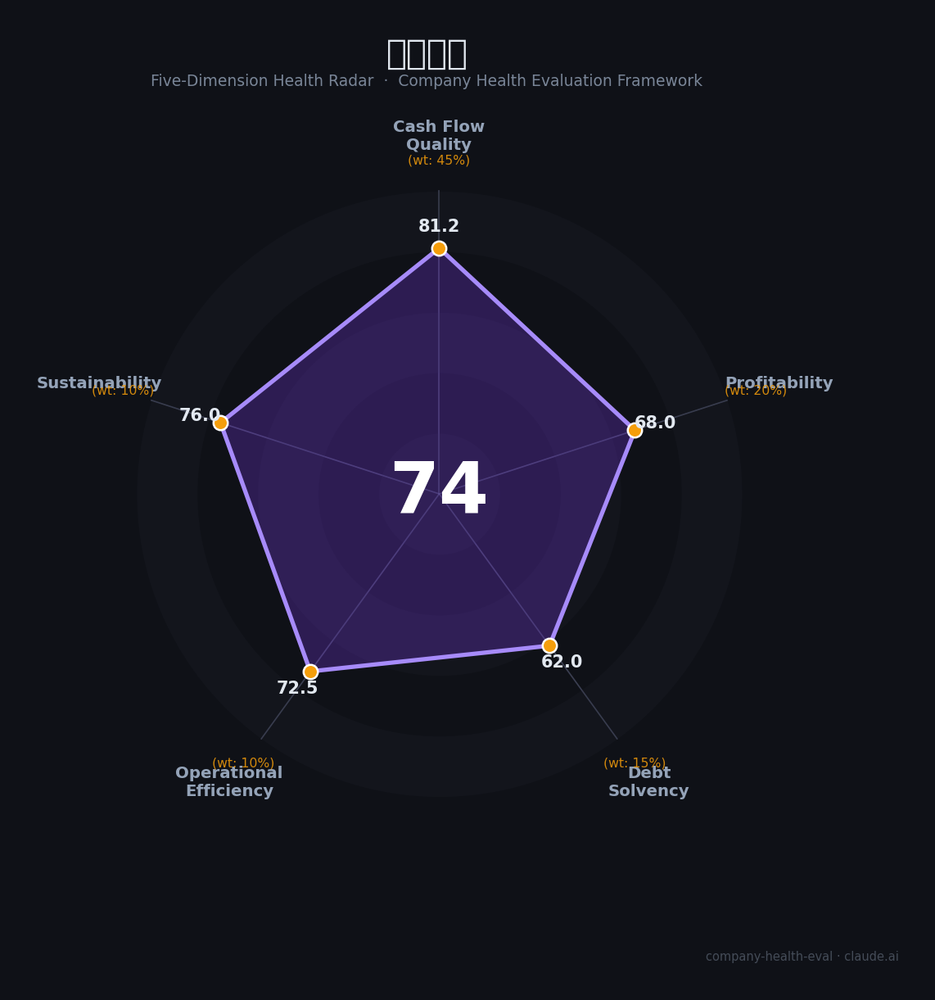

# 领益智造（002600.SZ）财务健康评估（2026-08-14）

## 一句话结论

🟡 **74/100，中等偏上** | 消费电子精密制造龙头，营收净利高增、成长强

---

## 一、公司基本画像

| 项目 | 内容 |
|------|------|
| 标签 | 消费电子精密制造龙头 |
| 主营 | 精密功能件/结构件/模组 |
| 财务 | 2025营收514.29亿(+16.2%)，归母净利22.88亿(+30.34%) |

> 一句话定性：消费电子精密制造，营收净利双增、AI获新增量

---

## 二、五维财务健康评估

### 1. 现金流质量（81/100）| 权重45%

经营现金流良好。

### 2. 盈利能力（68/100）| 权重20%

盈利稳健，AI/折叠机带来增量。

### 3. 偿债能力（62/100）| 权重15%

负债适中、偿债稳健。

### 4. 运营效率（72/100）| 权重10%

产能效率高。

### 5. 可持续发展（76/100）| 权重10%

AI终端、折叠屏、汽车电子打开成长空间。

---

## 三、综合评分

| 维度 | 得分 | 权重 | 加权 |
|------|:----:|:----:|:----:|
| 现金流质量 | 81 | 45% | 36.5 |
| 盈利能力 | 68 | 20% | 13.6 |
| 偿债能力 | 62 | 15% | 9.3 |
| 运营效率 | 72 | 10% | 7.2 |
| 可持续发展 | 76 | 10% | 7.6 |
| **综合得分** | **74/100** | 100% | 74.3 |

**健康等级：中等偏上** — 整体稳健，局部有待改善

---

## 四、核心风险清单

1. **苹果集中**
2. **消费电子周期**
3. **汇率**

## 五、求职/择业视角

### 核心优势
- 精密制造龙头、AI获新增量、现金流好
### 现有短板
- 客户集中、制造毛利中等

**结论**：领益智造消费电子精密制造龙头，营收净利双增，AI终端带来的成长性强，是深圳高端制造的优质标的。

---

*评估方法：商泰汽车（iAUTO）五维框架 · 数据截至2026年8月 · 财务来源领益智造2025年报*