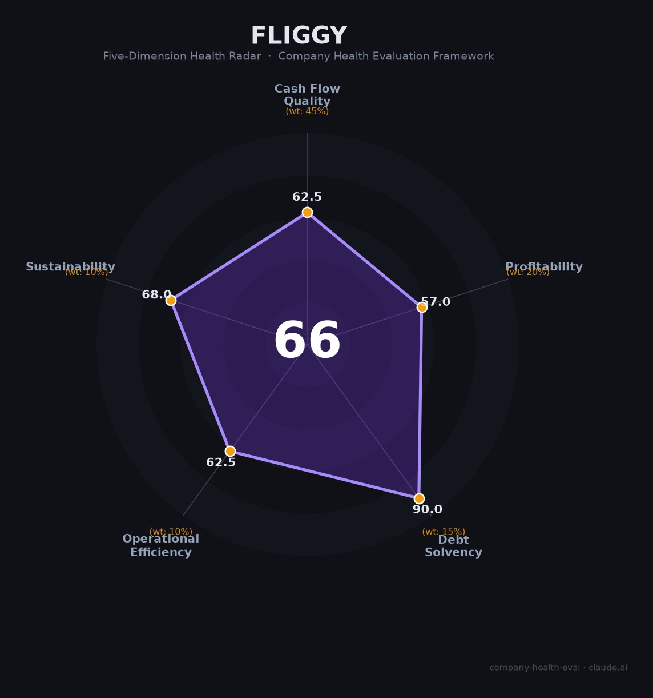

# 飞猪 财务健康评估（2026-06-20）

## 一句话结论
🟠 **中等 (Moderate) · 66/100** | 阿里生态庇护下的"跛脚巨人"——出境自由行赛道王者，但盈利成谜、用户流失、监管风暴叠加，投靠核心电商后的命运悬于蒋凡一念之间。

## 一、公司基本画像

| 维度 | 信息 |
|------|------|
| **运营主体** | 浙江飞猪网络技术有限公司 |
| **成立时间** | 2014年3月11日（品牌2010年以淘宝旅行起步，2016年更名飞猪） |
| **股权结构** | 阿里巴巴集团间接100%控股（ALITRIP SINGAPORE NETWORK TECHNOLOGY PRIVATE LIMITED） |
| **注册资本** | 1,539.84万人民币（实缴） |
| **法定代表人/CEO** | 庄卓然（花名：南天，2020年6月上任至今） |
| **员工规模** | 📊 估算2,000-4,000人（仅浙江主体社保参保1,886人，2023年报） |
| **主营** | 在线旅游平台（OTP模式）——机票、酒店、度假、签证 |
| **融资状态** | 从未独立融资，无独立估值 |
| **市场份额** | 📊 整体OTA约7-8%（第四）；出境自由行44.3%（第一） |
| **会员规模** | 累计超5亿（阿里官方），月活约3,000万（QuestMobile 2024.06，同比-15%） |
| **组织归属** | 2025年6月并入阿里巴巴中国电商事业群，向蒋凡汇报 |

**定性**：飞猪是阿里生态中的开放平台型OTA，以"先囤后约"（BNPL）模式和出境自由行差异化立足。作为阿里全资子公司，其生存不依赖自身盈利，而是取决于阿里集团的战略意志。2025年从"N"类边缘业务被重新纳入电商核心体系，是机遇也是压力测试。

## 二、五维财务健康评估

### 1. 现金流质量（62.5/100）⚠️ 权重45%

| 指标 | 判定 | 得分 | 依据 |
|------|------|:----:|------|
| 经营现金流净额 | ⚠️ 关注 | 55 | 飞猪财务不独立披露。FY2025阿里"所有其他"板块经调整EBITA为-85.36亿元，飞猪自身经营现金流大概率不稳定 |
| 现金及等价物 | ✅ 健康 | 90 | 阿里集团全资支持，资金由集团无限兜底 |
| 有息负债 | ✅ 健康 | 90 | 零独立有息负债，完全不依赖外部借贷 |
| 净现比 | 🔴 危险 | 15 | 飞猪大概率仍未盈利，经营现金流净额/净利润概念上为负 |

**关键判断**：飞猪的现金流质量完全依附于阿里集团。集团输血能力毋庸置疑（FY2025净利润约1,200亿元+），但独立生存能力存疑。一旦阿里战略转向（如剥离非核心资产），飞猪会立刻暴露现金流脆弱性。

### 2. 盈利能力（57.0/100）⚠️ 权重20%

| 指标 | 判定 | 得分 | 依据 |
|------|------|:----:|------|
| 毛利率 | ✅ 良好 | 75 | 📊 估算OTA平台综合毛利率50-65%（参考同程64%、携程81%，飞猪因纯平台模式take rate低于自营型，但佣金类收入天然高毛利） |
| 净利率 | 🔴 预警 | 15 | 媒体普遍判断飞猪尚未独立盈利（阿里从未单独披露飞猪利润，所属业务板块长期亏损） |
| 营收增速(3Y CAGR) | ✅ 良好 | 75 | 📊 GMV增速强劲（2025国庆+48%、双11+30%），营收增速应处于10-20%区间 |
| 研发费用率 | ✅ 良好 | 70 | 科技平台属性，AI驱动战略（接入通义千问），研发费率应在合理区间 |
| 人均产出 | ⚠️ 一般 | 50 | 📊 估算人均营收约20-40万元，远低于携程（130万/人）、同程（144万/人），但受估算不确定性影响不按alert处理 |

**关键判断**：高毛利平台模式的盈利能力本不应弱，但飞猪因规模不足（市占率仅7-8%）无法摊薄固定成本是亏损主因。GMV高增速为扭亏提供可能性，但当前处于"增收不增利"阶段。

### 3. 偿债能力（90.0/100）✅ 权重15%

| 指标 | 判定 | 得分 | 依据 |
|------|------|:----:|------|
| 资产负债率 | ✅ 健康 | 90 | 零有息负债，资本全部来自阿里注资 |
| 有息负债率 | ✅ 健康 | 90 | 0%，无任何银行贷款或债券 |
| 流动比率 | ✅ 健康 | 90 | 阿里资金池支持，流动资产充裕 |
| 现金比率 | ✅ 健康 | 90 | 同上 |
| 股权质押比例 | ✅ 健康 | 90 | 无股权质押，阿里全资持有 |

**关键判断**：偿债能力维度的满分来自于"不需要偿还任何债务"——飞猪完全没有独立负债。但这是双刃剑：没有债务 ≠ 经营健康，只是债权风险转移到了阿里集团层面。

### 4. 运营效率（62.5/100）⚠️ 权重10%

| 指标 | 判定 | 得分 | 依据 |
|------|------|:----:|------|
| 应收周转 | ✅ 健康 | 90 | OTA预付费模式，消费者先付款、平台后结算给商家，应收极少 |
| 客户集中度 | ✅ 健康 | 90 | 面向数亿消费者，无单一客户依赖 |
| 员工规模趋势 | 🔴 危险 | 15 | 2026年6月大规模裁员传闻（多路信源交叉印证，比例可能在20-40%区间） |
| 高管稳定性 | ⚠️ 关注 | 55 | CEO庄卓然在任6年稳定，但P9级AI产品负责人2026年3月离职；组织频繁调整（10个月经历2个产品/4个测试） |

**关键判断**：裁员是最大扣分项。2026年6月的裁员传闻虽未获飞猪官方证实，但阿里集团从25.93万峰值降至13.15万人（-49%）的大背景下，飞猪难以独善其身。AI替代（客服、编码）是结构性原因。

### 5. 可持续发展能力（68.0/100）⚠️ 权重10%

| 指标 | 判定 | 得分 | 依据 |
|------|------|:----:|------|
| 行业赛道空间 | ✅ 健康 | 90 | 中国OTA行业CAGR 11-22%（2023-2028），在线渗透率从33%→39%，空间充足 |
| 技术壁垒 | ⚠️ 关注 | 55 | OTA行业技术门槛低（京东0佣金入局即证）；飞猪壁垒在于阿里生态协同（88VIP+淘宝+高德）而非独立技术 |
| 客户/业务多元化 | ✅ 健康 | 90 | 机票+酒店+度假+签证多线，百万级个人消费者 |
| 融资/资本支持 | ✅ 健康 | 90 | 2025年并入阿里核心电商事业群，战略地位提升；阿里集团资金无限 |
| 政策/监管风险 | 🔴 危险 | 15 | 黑猫投诉12万+条；2026年连续遭国家/北京层面约谈；"幽灵机票"事件或成标志性判例 |

**关键判断**：政策监管风险是可持续发展维度的定时炸弹。2026年6月11日国家市场监管总局+网信办+国家铁路局三部门联合约谈，针对"候补帮抢"误导宣传等，飞猪是明确被点名平台。叠加大数据杀熟争议（F1/F4会员价格倒挂、三连涨）和"幽灵机票"诉讼，监管成本持续上升。

## 三、综合评分与健康等级

| 维度 | 得分 | 权重 | 加权得分 |
|------|:----:|:----:|:--------:|
| 现金流质量 | 62.5 | 45% | 28.1 |
| 盈利能力 | 57.0 | 20% | 11.4 |
| 偿债能力 | 90.0 | 15% | 13.5 |
| 运营效率 | 62.5 | 10% | 6.2 |
| 可持续发展 | 68.0 | 10% | 6.8 |
| **综合得分** | | **100%** | **66.1 / 100** |
| **健康等级** | | | **🟠 中等 (Moderate)** |

**解读**：偿债能力一支独大（阿里集团全资背书），其余四个维度均在55-68分区间。现金流和盈利能力的短板被阿里输血掩盖，但运营效率（裁员）和可持续发展（监管风险）的问题在2026年集中爆发。66.1分处于"中等"区间中位，与商汤科技（72分）、科大讯飞（61分）、DeepSeek（65分）处于同一级别。

## 四、同业对标

| 对比项 | **飞猪** | 携程 | 同程旅行 | 美团到店酒旅 |
|--------|:------:|:----:|:-------:|:----------:|
| 上市/融资状态 | 阿里全资子公司 | NASDAQ+HKEX | HKEX | HKEX（合并报表） |
| 营收规模 | 未披露（📊 约50-100亿） | 533亿 | 173亿 | 📊 约566亿 |
| 营收增速 | 📊 GMV+30-48% | +19.7% | +45.8% | 📊 +25-30% |
| 毛利率 | 📊 50-65%（估） | 81.3% | 64.1% | 📊 OPM 34.5% |
| 净利润 | 📊 大概率亏损 | 170.67亿 | 19.88亿 | 📊 OPM 34.5% |
| OTA GMV份额 | ~8% | ~56% | ~15% | ~13% |
| 员工规模 | 📊 2,000-4,000人 | 41,073人 | 12,000人 | 未拆分 |
| 核心差异化 | 出境自由行+阿里生态 | 中高端商旅壁垒 | 下沉市场+腾讯生态 | 本地生活高频流量 |
| 关键风险 | 盈利不明、监管密集、裁员 | 反垄断调查(2026.01) | 毛利率持续下降 | 抖音持续竞争 |

**对标结论**：飞猪在OTA行业是"小而美"的差异化玩家——出境自由行第一（44.3%），但整体规模仅为携程的1/7（按GMV），且盈利能力在四家中唯一存疑。2025年并入阿里电商核心后的增长势头（GMV+30-48%）超过携程（+19.7%），但能否持续取决于阿里战略耐心的长度。

## 五、核心风险清单

1. **监管合规风险（高）**：2026年6月三部门联合约谈+北京三部门约谈，飞猪均被点名。黑猫投诉超12万条且仍在增长。"幽灵机票"诉讼如原告胜诉（退一赔三），将开启类似案件的闸门。大数据杀熟禁令（2024年《消保条例》）持续施压。

2. **盈利不确定性（高）**：飞猪大概率尚未独立盈利。阿里电商事业群FY2026 Q2经调整EBITA从383.89亿骤降至105亿（主因即时零售投入），若集团整体利润承压，对飞猪的容忍度可能下降。

3. **裁员与人才流失（中高）**：2026年6月裁员传闻（20-40%）+ P9级AI负责人3月离职。阿里集团从25.93万人减至13.15万人（-49%），飞猪很难逆势扩编。AI替代（客服+基础开发）是结构性而非周期性变化。

4. **用户规模萎缩（中高）**：MAU同比下降15%至约3,000万（2024.06），与携程（+4.9%）、去哪儿（+9.1%）形成鲜明反差。用户流失直接影响GMV增长天花板。

5. **竞争格局恶化（中）**：抖音酒旅GMV约1,500亿（增速140%）、京东"三年0佣金"入局、小红书占据旅行决策入口。飞猪在"内容种草→交易转化"链条中处于弱势。

6. **阿里战略优先级变动（中）**：飞猪历史上多次变更组织归属（本地生活→N序列→电商事业群），每次调整都带来战略方向的不确定性。虽然当前入群电商是利好，但阿里历史上曾剥离银泰、高鑫零售等非核心资产。

## 六、求职/择业视角

### 核心优势
- **稳定性评估**：作为阿里全资子公司，只要不被剥离就不会倒闭。但2026年6月裁员表明"不倒闭≠不裁你"。
- **工作强度**：在阿里体系内属于"相对不卷"的BU（牛客网多位用户证实），双休有保障。
- **技术/业务价值**：OTA行业经验可迁移至携程、同程、美团酒旅、抖音酒旅，行业通用性强。
- **阿里品牌背书**：简历上的"阿里巴巴"对跳槽有加分，尤其在中小互联网公司。

### 现存短板
- **薪酬上限**：阿里系"低base+中奖金+高期权"模式，现金竞争力弱于字节/拼多多。且飞猪无独立股权，阿里集团股价直接影响收益。
- **职业天花板**：飞猪在阿里内部属边缘业务线，晋升通道和资源倾斜度不如淘天、阿里云等核心BU。
- **组织动荡**：频繁的组织架构调整+裁员，长期规划风险高。

### 分场景建议

| 个人诉求 | 推荐度 | 替代方案 |
|----------|:------:|---------|
| 稳定+深耕 | ⚠️ 次选 | 携程（盈利能力极强，行业绝对龙头） |
| 高薪+跳板 | ⚠️ 次选 | 美团酒旅（现金薪酬行业领先）、字节/抖音 |
| 成长+融资红利 | ⚠️ 次选 | 同程旅行（增速最快+腾讯生态）、小红书旅行 |
| 多元+跨领域 | ✅ 可以 | 飞猪内部跨BU转岗至淘天/饿了么/高德可能性存在 |

**一句话建议**：如果已有offer，对薪资要求不高且看重WLB，飞猪可以作为阿里体系的跳板（干1-2年→内部转岗或跳携程/美团）。但如果追求高薪或稳定性，携程和美团酒旅是更好的选择。

## 七、总结

飞猪是在线旅游领域「出境自由行赛道第一、整体第四」的公司：**阿里生态的无限现金流支持**是最大安全垫，唯一无法回避的短板是**自身盈利能力成谜 + 2026年监管风暴密集升级**。在在线旅游渗透率持续提升（33%→39%）的大环境下，属于**中等风险**，适合**将飞猪作为阿里体系跳板、且对短期薪资波动容忍度较高**的求职者的选择。

---

*评估日期：2026-06-20 · 数据来源：阿里巴巴集团年报（FY2024-FY2025）、QuestMobile、Fastdata极数、券商研报（交银国际/东吴证券/中国银河证券）、黑猫投诉、启信宝/天眼查、牛客网/脉脉用户口碑 · 标注📊为基于公开信息的推算，非官方数据*
