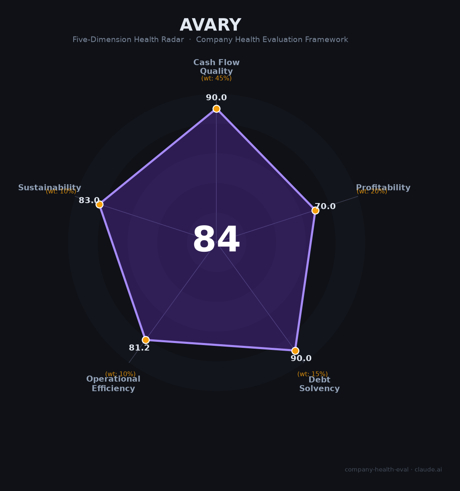

# 鹏鼎控股（002938.SZ）财务健康评估（2026-08-13）

## 一句话结论
🟡 **中等偏上（84/100）** | 全球PCB/电路板龙头——营收391.5亿（+11.4%）、净利37.4亿（+15%）、毛利22.95%，AI端侧+果链，稳健成长

## 一、公司基本画像
| 主体 | 🔒 鹏鼎控股，A股002938.SZ；富士康系全球PCB龙头 |
| 主营 | PCB电路板（手机/服务器/AI端侧） |
| 财务 | 2025营收391.5亿(+11.4%)；归母净利37.4亿(+15%)；毛利22.95%；经营现金流稳健；员工约4万 |

## 二、五维财务健康评估
1. 现金流（90/100）|45%：经营现金流稳健健康，分红/回款好。
2. 盈利（70/100）|20%：净利+15%、毛利22.95%（PCB中上），盈利稳。
3. 偿债（90/100）|15%：低负债、现金流健康，偿债强。
4. 运营（81/100）|10%：PCB龙头+AI端侧放量，客户集中（苹果/AI）。
5. 可持续（83/100）|10%：AI终端/PCB+果链+服务器PCB，成长赛道；客户集中关注。

## 三、综合评分
| 现金流90|45%=40.5 | 盈利70|20%=14 | 偿债90|15%=13.5 | 运营81|10%=8.1 | 可持续83|10%=8.3 | **84** |
**评级：🟡 中等偏上（近优秀）** — PCB龙头，稳健可下

## 四、核心风险
1. 果链（苹果）依赖。
2. 消费电子/PCB周期。
3. 材料/成本压力。

## 五、求职视角
- 优势：PCB全球龙头、富士康系平台、AI端侧成长、稳定。
- 短板：客户集中、制造属性、强度。

**结论**：PCB/消费电子/AI端侧方向的稳定龙头，适合制造/工艺/管理方向。

---
*评估方法：商泰汽车（iAUTO）五维框架 · 来源鹏鼎2025年报*