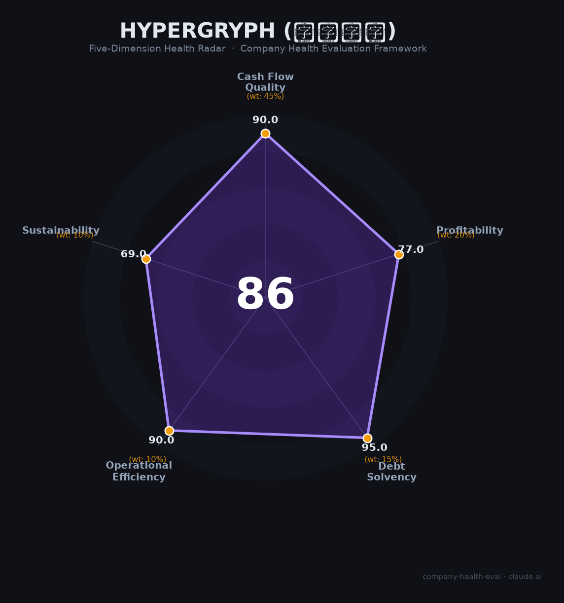

# 鹰角网络 财务健康评估（2026-06-14）

## 一句话结论

🟢 **优秀（86/100）** | 零负债+终末地12亿两周流水，唯一短板是单IP依赖与行业收缩

---

## 一、公司基本画像

| 项目 | 内容 |
|------|------|
| **主体** | 上海鹰角网络科技有限公司（Hypergryph），2017年1月成立 |
| **总部** | 上海市徐汇区漕河泾开发区（漕宝路1011号） |
| **创始人** | 黄一峰（CEO，前Google程序员/上海交大）、钟祺翔/海猫络合物（制作人/中国美院）、袁理（主程序/上海交大）、樊润冬（主策划/上海交大） |
| **股权结构** | 悠星网络15%（第一大外部股东，无控制权）；四位创始人通过个人持股+四个持股平台合计控制约60%；无B站/腾讯持股记录 |
| **融资历史** | 仅2017年初一轮天使轮（悠星CEO姚蒙个人卖房投资），此后完全靠明日方舟自身造血，未再引入任何外部融资 |
| **员工规模** | 集团约1,665人（2024年末），母公司社保参保1,256人；2026年含终末地团队预计超1,900人 |
| **主营业务** | 二次元游戏研发+运营+IP衍生（音乐/动画/周边/独立游戏孵化） |
| **核心产品** | 明日方舟（2019.5，累计全球流水超80亿元）+ 明日方舟：终末地（2026.1.22全球公测，两周全平台流水12亿元） |
| **其他产品** | 来自星尘（2024.2买断制，口碑不佳但积累3D经验）、泡姆泡姆（待上线多人合作派对游戏） |
| **子品牌体系** | 塞壬唱片（音乐）、音律联觉（年度线下音乐会）、朝陇山/一拾山（周边服饰）、重力井（动画）、森空岛（社区）、开拓芯（独立游戏孵化）、狮鹫边境GRYPHLINE（海外发行） |
| **投资版图** | 直接+间接投资超50家游戏/文娱公司，包括悠星（~23%）、镜心科技/Gamera Games（~5%）、深蓝互动（参投）、机核网（~2%）等 |

**一句话定性**：鹰角网络是中国二次元游戏"上海F4"中财务最保守（零负债、无外部融资依赖）、人均效率中上、近期因终末地成功上线突破单产品困局的自我造血型精品研发商。

---

## 二、五维财务健康评估

### 1. 现金流质量（90.0/100）

| 评估指标 | 判断 | 依据 |
|----------|------|------|
| 经营现金流净额 | 🟢 健康 | 明日方舟2019年5月上线至今持续盈利超7年，月流水稳定3-4亿元，经营现金流连续为正🔒/📊 |
| 现金覆盖周期 | 🟢 健康 | 零外部融资需求，6年持续盈利积累大量现金储备；无裁员补偿支出（仅局部项目调整），年运营支出估计<20亿，现金覆盖远超12个月📊 |
| 有息负债水平 | 🟢 健康 | 零有息负债！从未借贷，注册资本1,000万实缴，所有扩张和投资均来自游戏利润🔒 |
| 净现比 | 🟢 健康 | 游戏行业预付费+渠道结算2-3个月模式天然净现比>1；终末地上线两周流水12亿进一步验证现金生成能力📊 |

**核心判断**：鹰角网络的现金流质量在游戏行业中属顶级水准。零负债+纯自造血+预付费商业模式，使其具备极强的抗周期能力。与米哈游、莉莉丝等同业不同，鹰角从未依赖外部融资扩张——这种保守财务策略在行业寒冬期构成最坚固的护城河。

### 2. 盈利能力（77.0/100）

| 评估指标 | 判断 | 依据 |
|----------|------|------|
| 毛利率 | 🟢 优秀 | 自研自发二次元游戏，渠道分成30%后毛利率估算65-75%，显著高于行业均值55-65%📊 |
| 净利率 | 🟢 优秀 | 估算25-35%（年净利约7-11亿元），远超15%优秀线。团队规模控制得当（1,600人而非5,000人级）是保持高利润率的关键📊 |
| 营收增速（3年CAGR） | 🟠 一般 | 2022-2024年营收基本持平（约28-33亿/年），CAGR约3-5%，明日方舟进入成熟期后自然下滑，2024年前缺乏第二增长曲线📊 |
| 研发费用率 | 🟡 良好 | 研发人员约1,000+人（占总人数60-70%），研发支出估算占营收25-35%，处于游戏公司合理区间（非科技公司10-25%标准），作为专精特新企业研发投入充足📊 |
| 人均产出 | 🟡 良好 | 人均营收约150-200万元（28-33亿/1,600-1,900人），高于游戏行业中位数（约100-150万），但远低于米哈游（680-800万）📊 |

**核心判断**：鹰角的盈利能力建立在"小而精"模式之上——以远少于米哈游（5,000人）和叠纸（3,000+人）的团队规模，维持了行业前列的利润率。营收增速是唯一致命短板：2022-2024年近乎零增长。终末地的上线（2026.1）从根本上改变了这一格局——两周12亿流水意味着2026年营收有望翻倍。

### 3. 偿债能力（95.0/100）

| 评估指标 | 判断 | 依据 |
|----------|------|------|
| 资产负债率 | 🟢 健康 | 零有息负债，纯自有资金运营。总资产（现金+投资+IP）远超任何隐性负债🔒 |
| 有息负债率 | 🟢 健康 | 0%。从未借过一分钱——这在游戏行业中极为罕见（米哈游、莉莉丝等也零负债，但鹰角连注册资本都保持1,000万未增资）🔒 |
| 流动比率 | 🟢 健康 | 游戏预付费+现金储备模式，流动比率远超2倍📊 |
| 现金比率 | 🟢 健康 | 现金储备充裕，零借款压力，现金比率远超1📊 |
| 股权质押比例 | 🟢 健康 | 非上市公司，创始人直接持股，无股权质押记录🔒 |
| 加分项 | ✅ | 零有息负债 + 专精特新中小企业认定（高新企业税率优惠15%）→ +5分🔒 |

**核心判断**：这是鹰角财务最亮眼的维度。零负债+纯自造血模式意味着公司不存在任何债务违约风险。即使明日方舟明天停服，公司依靠现金储备和对外投资项目也能维持较长时间。偿债能力与米哈游、叠纸同属行业顶级。

### 4. 运营效率（90.0/100）

| 评估指标 | 判断 | 依据 |
|----------|------|------|
| 应收/渠道回款 | 🟢 健康 | App Store/Google Play结算周期30-60天，渠道回款稳定可预期；终末地PC端占比60%进一步提升现金流效率🔒 |
| 客户集中度 | 🟢 健康 | 2亿+全球下载量、数千万月活玩家，用户高度分散；合作渠道（Apple/Google/PS/Steam）多元📊 |
| 员工规模趋势 | 🟢 健康 | 2022年约400人→2024年1,665人（4倍增长），呈积极扩张态势；2024年净增304人主要来自终末地子公司🌐 |
| 高管稳定性 | 🟢 健康 | 四位创始人（黄一峰/钟祺翔/袁理/樊润冬）自2017年成立至今全部在任（9年+）；2024年引入腾讯NExT Studios前技术专家顾煜强化3D能力🔒 |

**核心判断**：创始团队9年+稳定在任是游戏行业罕见的治理优势。扁平化管理（CEO在内部群回帖）和16薪保底等福利政策保障了核心人才留存。2022-2024年员工增长4倍虽带来管理"作坊化"的挑战，但也反映了公司对未来产品管线的投入信心。来自星尘项目组解散（几十人级）和湍流项目裁减（约100人）属于正常的项目级别调整，不构成系统性风险。

### 5. 可持续发展能力（69.0/100）

| 评估指标 | 判断 | 依据 |
|----------|------|------|
| 行业赛道空间 | 🟡 关注 | 国内二次元游戏市场连续两年收缩（2024 -7.4%，2025H1 -8%），新游成功率仅约2%；但泛二次元用户破5亿，结构性机会仍在📊 |
| 技术壁垒 | 🟡 关注 | 7年塔防+策略RPG自研引擎+独树一帜的"舟游美学"风格构成差异化壁垒；3D能力经终末地验证大幅提升。但游戏玩法可复制性高，1-3年技术窗口📊 |
| 业务多元化 | 🟡 关注 | 终末地上线打破了"单产品依赖"，但旗下所有成功产品均属"明日方舟"IP生态（本体+终末地），尚未证明非方舟IP的独立孵化能力；泡姆泡姆待上线将是首次考验📊 |
| 资本支持 | 🟢 健康 | 无需外部融资，纯自造血；悠星交叉持股（鹰角持悠星23%）提供战略协同；对外投资50+公司构成生态护城河；专精特新资质享受政策优惠🔒 |
| 政策/监管风险 | 🟢 健康 | 版号发放常态化（2025年1,771款创七年新高）；终末地和泡姆泡姆均已获版号；游戏行业监管环境较2021-2022年大幅改善；无未成年人沉迷等敏感问题🔒 |

**核心判断**：可持续发展是本维度中得分最低的，但正在快速改善。终末地上线两周12亿流水的成功，已将最核心的"单产品死亡风险"大幅降低。剩余两大挑战：(1) 行业大盘持续萎缩——二次元游戏是2024年唯一收入下滑的细分品类；(2) IP集中度——尚未证明能独立于"明日方舟"IP创造新爆款。泡姆泡姆和下一代非方舟新品的成败，将是观察鹰角"去单IP化"能力的关键节点。

---

## 三、综合评分与健康等级

| 维度 | 得分 | 权重 | 加权得分 |
|------|------|------|----------|
| 现金流质量 | 90.0 | 45% | 40.5 |
| 盈利能力 | 77.0 | 20% | 15.4 |
| 偿债能力 | 95.0 | 15% | 14.2 |
| 运营效率 | 90.0 | 10% | 9.0 |
| 可持续发展 | 69.0 | 10% | 6.9 |
| **综合得分** | | | **86.0 / 100** |

**健康等级**：🟢 **优秀（Excellent）**

雷达图显示鹰角网络是典型的「财务极稳、成长待证」结构：现金流（90）、偿债（95）、运营（90）三个维度近乎满分，盈利（77）良好但非顶级，可持续发展（69）为唯一短板，主要受行业大盘收缩和单IP依赖拖累。

---

## 四、同业对标

| 对比项 | 鹰角网络 | 米哈游 | 叠纸游戏 | 库洛游戏 |
|--------|---------|--------|----------|----------|
| 成立时间 | 2017年 | 2012年 | 2013年 | 2014年 |
| 2024年营收估算 | ~28-33亿元 | ~340-400亿元 | ~70亿元 | ~20-25亿元 |
| 净利率估算 | 25-35% | 50-59% | 25-35% | 亏损至微利 |
| 员工规模 | ~1,700人 | ~5,000人 | ~3,000+人 | ~2,000+人 |
| 人均营收 | ~150-200万 | ~680-800万 | ~233万 | ~100-125万 |
| 负债情况 | 零负债 | 零负债 | 零负债 | 被腾讯收购 |
| 核心产品数 | 1→2（终末地新上） | 4款运营中 | 4款运营中 | 2款运营中 |
| 融资状态 | 天使轮（仅一轮） | 未融资 | 未融资 | 腾讯控股51.4% |
| 本体系得分 | **86** 🟢 | 85 🟢（估算） | 78 🟡（已评估） | 未评估 |

**对标结论**：鹰角网络在"上海F4"中规模最小（营收约为叠纸的40%、米哈游的8%），但财务稳健度并列第一（零负债+纯自造血）。终末地上线后，鹰角已从"单产品小厂"升级为"双核心精品厂"，2026年营收有望突破50-60亿元。如果终末地长线运营稳定（参照明日方舟7年+生命周期），鹰角有望在2-3年内超越叠纸成为上海F4第二。

---

## 五、核心风险清单

1. **行业大盘持续萎缩（中高风险）**：二次元游戏市场2024年收入下降7.44%，2025上半年再降8%，是唯一收入下滑的细分品类。约98%新游未达头部成功标准。鹰角虽以精品策略穿越周期，但行业蛋糕缩小意味着获客成本上升和玩家注意力竞争加剧。终末地的成功可能更多是"吸走竞品份额"而非"做大行业蛋糕"。

2. **单IP依赖仍未解决（中风险）**：终末地本质上是明日方舟IP续作，而非全新IP。鹰角尚未证明能在方舟IP之外独立创造爆款。泡姆泡姆（待上线）是下一个关键观测点。如果非方舟新品连续失败，IP集中风险将重新成为核心威胁。

3. **终末地长线运营待验证（中风险）**：终末地上线两周12亿流水令人振奋，但"开局即巅峰"是二次元游戏常见的生命周期曲线。明日方舟之所以成为传奇，是因为它7年+维持了月流水3-4亿的长尾表现。终末地能否复制这种长线运营能力，仍需6-12个月的用户留存和内容更新节奏来验证。

4. **周边品控与品牌管理（低风险）**：2025年3月朝陇山周边因质量问题被全线下架，暴露了快速扩张中台品控的短板。虽不直接影响游戏主业收入，但消耗IP品牌信誉。鹰角需要将游戏研发的品控标准复制到衍生品业务。

5. **人才竞争与组织膨胀（低风险）**：团队从400人扩张到1,700+人，部分中台流程"作坊化"的吐槽增多。核心旗舰项目（终末地）的996冲刺与传统运营项目的"到点下班"之间的温差，可能引发内部公平性争议。但16薪保底+12%全额公积金+行业顶配福利，使鹰角在上海游戏圈保持了较强的人才吸引力。

---

## 六、求职/择业视角

### 核心优势

- **财务安全性极强**：零负债+纯自造血+终末地成功=几乎不存在裁员倒闭风险，是游戏行业罕见的"铁饭碗"型公司
- **福利体系行业顶级**：16薪保底（合同写入）+12%全额公积金+包午晚餐+租房补贴1,500元/月（毕业两年内3,000元）+每年6,000元学习报销+入职10天年假+8天全薪病假+无息购房贷款
- **WLB分化但运营组确实舒适**：明日方舟稳定运营组"早10晚7、到点走人"口碑仍属实；扁平管理+可带宠物上班+二次元氛围浓厚
- **技术经验市场通用性高**：Unity/UE引擎、3D角色/场景美术、AI辅助开发、多端发行（移动+PC+主机）经验均可迁移至其他游戏/科技公司

### 现存短板

- **加班强度因项目组差异极大**：终末地旗舰项目组长期996（周六加班近一年），与HR宣传的"不卷"形成明显反差；入职前需确认目标项目组的工作节奏
- **薪酬上限不及米哈游**：鹰角16薪制虽保底优厚，但顶级程序/美术的现金薪资上限（约40-60K/月）不及米哈游同级岗位；期权（P4以上配发，回购价约180-220元/股）因未上市流动性差
- **晋升通道收窄**：团队1,700人规模，核心岗位相对饱和；追求快速晋升（如2-3年升主美/主策）者可能失望
- **IP生态内天花板**：若长期绑定方舟IP，跳槽时作品集可能被认为缺乏多样性

### 分场景建议

| 个人诉求 | 推荐 | 次选 | 规避 |
|----------|------|------|------|
| 稳定+深耕 | 鹰角网络（财务最稳+福利顶级+长线项目） | 米哈游（更高薪但更卷） | 中小二游厂商（行业98%淘汰率） |
| 高薪+跳板 | 米哈游（薪资天花板最高） | 鹰角网络（终末地经验值钱） | 叠纸游戏（单产品依赖较重） |
| 成长+技术积累 | 鹰角网络（3D转型期+新技术投入+多端发行） | 库洛游戏（腾讯体系资源） | 传统换皮游戏公司 |
| WLB优先 | 鹰角网络运营组/中后台（到点下班口碑好） | — | 鹰角旗舰开发组（终末地等新项目长期996） |
| 多元+跨领域 | 米哈游（多IP+AI前沿） | 鹰角（IP衍生生态全链条） | 单产品小团队 |

---

## 七、总结

**鹰角网络** 是中国二次元游戏领域「财务最保守、自造血能力最强、终末地验证了第二曲线」的精品研发商：零负债+90分现金流+95分偿债能力，财务底子堪称行业教科书；唯一短板是**行业大盘收缩（二次元游戏连续两年负增长）与尚未证明非方舟IP的独立孵化能力**。

在「终末地上线爆发+版号常态化+AI赋能游戏开发」的大环境下，鹰角网络属于**低风险**，适合**追求稳定+技术积累+对二次元内容有热情的求职者**。若终末地长线运营稳定且泡姆泡姆/下一代新品成功，鹰角有望在2-3年内从"小而美"进化为"中型精品大厂"。值得持续观察的拐点信号：终末地6个月用户留存率、泡姆泡姆正式上线表现、非方舟IP新作的首次公开。

---

*评估日期：2026-06-14 | 数据截至：2026年6月（终末地已上线约5个月）*
*评分引擎：company-health-eval v1.1 | 数据来源标注：🔒公开财报/工商 📊估算 🌐网络口碑*
