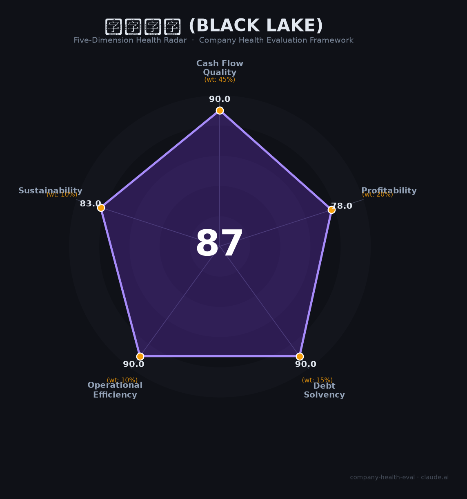

# 黑湖科技 财务健康评估（2026-06-19）

## 一句话结论

🟢 **优秀（87/100）** | SaaS MES绝对龙头+已盈利+增速>60%+国家级基金背书，中小企业PMI承压是唯一隐忧

## 一、公司基本画像

| 项目 | 内容 |
|------|------|
| **运营主体** | 上海黑湖网络科技有限公司 / 上海黑湖科技有限公司 |
| **成立时间** | 2016年 |
| **法定代表人** | 周宇翔（创始人/CEO） |
| **注册资本** | 40,000万元（网络科技主体） |
| **员工规模** | ~1,000人（研发占比>30%，销售~300人） |
| **总部** | 上海长宁区武夷路333号（全国多城分支机构） |
| **融资历史** | 天使（真格/IDG）→A轮GGV→A+轮BAI/金沙江→B轮¥1.5亿→C轮¥近5亿（淡马锡领投）→**D轮2026.4月¥近10亿**（国家AI产业投资基金/上海国投等） |
| **估值** | **>¥70亿**（D轮投后，🦄独角兽） |
| **核心产品** | 黑湖智造（SaaS MES）+ 黑湖小工单（¥10,800-18,800/年轻量MES）+ 黑湖供应链 + 11个工业AI智能体 |
| **市场地位** | SaaS MES市占率**42.7%**（#1），云化MES **52.7%**（#1），整体MES **第2**（IDC 2024，仅次于宝信软件） |
| **客户规模** | 近**40,000家**工厂，覆盖30+行业（农夫山泉/蜜雪冰城/特斯拉/宁德时代/百威/蒙牛等） |
| **盈利状态** | 2024年11月**实现全面盈利**，营收年增速>60% |
| **IPO状态** | D轮被定性为「Pre-IPO冲刺轮」，具体地点待定 |

**一句话定性**：黑湖科技是中国工业SaaS领域的标杆——以纯SaaS模式颠覆传统MES，SaaS MES市占率绝对第一，在中国SaaS行业普遍亏损的背景下已全面盈利+增速>60%，D轮获国家级AI基金背书进入IPO冲刺阶段。唯一核心风险是下游中小制造企业PMI承压对续费率的潜在冲击。

## 二、五维财务健康评估

### 1. 现金流质量（90.0/100）

| 指标 | 判断 | 说明 |
|------|------|------|
| 经营现金流 | ✅ 健康 | 2024.11已全面盈利，营收增速>60%，SaaS订阅模式现金流可预测性强 |
| 现金储备 | ✅ 健康 | D轮¥近10亿（2026.4到账）+ 自身经营盈利，现金跑道极为充裕 |
| 有息负债 | ✅ 健康 | 纯股权融资（8轮超¥20亿），零有息负债 |

**评估**：黑湖是中国极少数已盈利的SaaS公司，SaaS订阅模式+高增速带来的经营现金流质量在中国SaaS行业中属于顶级。

### 2. 盈利能力（78.0/100）

| 指标 | 判断 | 说明 |
|------|------|------|
| 毛利率 | ✅ 良好 | 📊 估40-50%（纯SaaS模式，高于赛美特35-44%，低于全球SaaS基准78%。考虑部分大客户定制化拉低综合毛利率） |
| 净利率 | ✅ 良好 | 📊 2024.11刚扭亏为盈，估5-15%，随规模效应持续改善 |
| 营收增速 | ✅ 优秀 | >60%（公司D轮公告披露），远超20%门槛 |
| 研发费用率 | ✅ 优秀 | 研发占比>30%（~300人），📊 估营收的15-25%，属科技公司黄金区间 |
| 人均产出 | 📊 一般 | 📊 估¥30-80万/人（¥3-8亿/~1,000人），SaaS规模化后有望快速提升 |

**评估**：增速>60%+已盈利的组合使其在中国SaaS中极为稀缺（对比用友亏损¥20亿、树根累亏¥17亿）。随着客户基数扩大+AI Agent上线，利润率和人均产出有进一步提升空间。

### 3. 偿债能力（90.0/100）

| 指标 | 判断 | 说明 |
|------|------|------|
| 资产负债率 | ✅ 健康 | 纯股权融资，零有息负债 |
| 有息负债率 | ✅ 健康 | 零 |

**评估**：偿债风险为零。D轮国家基金领投进一步加强了资本实力。

### 4. 运营效率（90.0/100）

| 指标 | 判断 | 说明 |
|------|------|------|
| 应收周转 | ✅ 健康 | SaaS年费预付/定期扣费模式，回款周期短于传统项目制MES |
| 客户集中度 | ✅ 健康 | 近40,000家工厂，完全分散 |
| 员工规模趋势 | ✅ 健康 | 500→1,000人持续增长，无裁员记录（SaaS裁员潮中逆势扩张） |
| 高管稳定性 | ✅ 健康 | 周宇翔自2016年创立至今担任CEO，核心团队稳定 |

**评估**：运营效率极佳。在2023-2024中国SaaS大面积裁员的背景下逆势扩张，双休+六险一金+年终13-15薪福利完善。

### 5. 可持续发展能力（83.0/100）

| 指标 | 判断 | 说明 |
|------|------|------|
| 行业赛道 | ✅ 健康 | SaaS MES市场+15.2% YoY，AI+工业软件CAGR 41-43%，政策强力驱动（「人工智能+制造」、设备更新¥200万套） |
| 技术壁垒 | ✅ 健康 | 52.7%云化MES市占率+4周实施（传统9-18月）+30+行业Know-how+11个工业AI Agent，护城河极深 |
| 业务多元化 | ✅ 健康 | 小工单（小微）+智造（中大）+供应链+AI Agent四线并行，30+行业覆盖 |
| 资本支持 | ✅ 健康 | 国家AI产业投资基金D轮领投+淡马锡/GGV/金沙江/BAI全明星阵容+已盈利+Pre-IPO |
| 政策/外部风险 | ⚠️ 关注 | 中小制造企业PMI持续<50%（2026.5中型48.6%/小型48.5%），小工单客户付费能力承压 |

**评估**：可持续性极为强劲，技术壁垒、政策利好、资本支持均处于历史最佳窗口。唯一风险来自下游中小企业宏观经济承压——55.12%中小企业认为「资金不足」是数字化转型最大障碍，黑湖小工单（¥10,800/年）虽已触底价，但客户流失风险仍存。

## 三、综合评分与健康等级

| 维度 | 得分 | 权重 | 加权得分 |
|------|------|------|----------|
| 现金流质量 | 90.0 | 45% | 40.5 |
| 盈利能力 | 78.0 | 20% | 15.6 |
| 偿债能力 | 90.0 | 15% | 13.5 |
| 运营效率 | 90.0 | 10% | 9.0 |
| 可持续发展 | 83.0 | 10% | 8.3 |
| **综合得分** | | | **86.9/100** |
| **健康等级** | | | 🟢 **优秀（Excellent）** |

## 四、同业对标

| 对比项 | 黑湖科技 | 鼎捷数智（300378） | 赛美特（拟IPO） | 树根互联（IPO撤回） |
|--------|---------|------------------|----------------|-------------------|
| 上市/融资状态 | D轮>¥70亿，Pre-IPO | A股上市，市值~¥200亿 | 港股冲刺中，D轮¥73亿 | 科创板IPO撤回（2023） |
| 营收规模 | 📊 ¥3-8亿（估） | ¥24.33亿（2025） | ¥7.31亿（2025） | ¥5.17亿（2021） |
| 毛利率 | 📊 估40-50% | 58.6% | 35.6%（三连降） | 40.1%（2021） |
| 净利率 | 已盈利（刚转正） | 6.7% | 10.0% | **-137%（巨亏）** |
| 营收增速 | **>60%** | 4.4% | 46.4% | 85.3%（2021） |
| IDC MES排名 | **#2（SaaS MES #1）** | #8 | 未入前8（半导体垂直） | 未入前8 |
| 客户数 | **40,000家** | 200,000+（含ERP） | 843家 | 聚焦大型装备 |
| 部署模式 | **纯SaaS云原生** | 传统+云混合 | 项目制 | 工业互联网平台 |
| 核心差异 | 已盈利+增速最快+市占第一 | 传统巨头，增速低 | 毛利率三连降，半导体聚焦 | 关联交易>50%，持续巨亏 |

**对标结论**：黑湖科技在工业SaaS赛道中处于**绝对领先地位**——增速最高（>60%）+唯一纯SaaS已盈利+MES市场排名超越西门子。鼎捷虽体量更大但增速仅4.4%，赛美特毛利率三连降，树根累亏¥17亿IPO失败。在中国SaaS「几乎没有公司因为做SaaS模式上市的」的悲观环境中，黑湖是最有希望打破魔咒的候选者。

## 五、核心风险清单

1. **中小企业PMI持续收缩→小工单客户流失（高）**：2026.5中小制造业PMI仅48.5%-48.6%，购进价格60.5% vs 出厂价格51.9%，利润被严重挤压。55%中小企业认为「资金不足」是数字化最大障碍。小工单¥10,800/年虽已是地板价，但若大量小微工厂倒闭或降级经营，客户基数将受冲击。

2. **「Pre-IPO冲刺」的估值兑现压力（中）**：D轮¥70亿估值对应PS估>10x（若营收¥5-7亿）。在中国SaaS板块PS从10-20x跌至2-3x的市场环境下，IPO估值能否维持存在不确定性。有赞市值跌95%、微盟单日跌40%的前车之鉴值得警惕。

3. **大型企业自研MES的长期替代风险（中）**：超级工厂（宁德时代/比亚迪级别）IT团队强大，可能选择自研替代第三方SaaS。黑湖以模块化+开放API+4周部署对冲此风险，但长期替代压力存在。

4. **海外扩张的双向合规成本（中低）**：D轮募资用途包括越南/马来西亚/墨西哥扩张，需同时满足中国数据出境监管+当地法规，合规成本将上升。

5. **AI定价模式转型风险（中低）**：行业正从「按席位订阅」转向「按效果付费」，黑湖的11个工业AI Agent需要证明新定价模式的商业化可行性。

## 六、求职/择业视角

### 核心优势
- **中国工业SaaS标杆**：SaaS MES市占率绝对第一，超越西门子的国产替代旗手，简历含金量极高
- **已盈利+高增速**：在中国SaaS普遍亏损裁员的环境中是极为罕见的「增长+盈利」双引擎标的，稳定性极强
- **IPO红利窗口**：D轮被定性为Pre-IPO冲刺轮，早期员工期权有明确变现预期
- **双休+六险一金+14薪**：福利体系完善，招聘宣传「不内卷、强调结果」
- **国家级背书**：创始人2025年参加李强总理经济座谈会+国家级基金D轮领投+「优秀建设者」表彰，公司稳定性有政策托底

### 现存短板
- **薪资在SaaS行业中中等**：技术岗16K-50K/月，在上海互联网圈属中上但不及大厂
- **员工口碑信息断层**：脉脉/看准/知乎均无员工评价，实际工作体验（加班文化/管理风格）存在信息盲区。面试反馈「等待时间较长」需注意
- **工业赛道局限性**：工业SaaS经验在消费互联网公司适用度有限，跨行业跳槽成本较高
- **IPO时间表不明确**：Pre-IPO≠已提交招股书，具体上市时间和地点未定

### 分场景建议

| 个人诉求 | 推荐 | 次选 | 规避 |
|----------|------|------|------|
| 稳定+深耕 | **黑湖科技**（已盈利+逆势扩张+零裁员） | 鼎捷数智（上市稳定） | 烧钱未盈利SaaS |
| 高薪+期权回报 | **黑湖科技**（Pre-IPO窗口+国家级背书） | 赛美特（港股冲刺中） | 传统工业软件 |
| 技术成长 | **黑湖科技**（云原生+AI Agent前沿） | 新核云 | 传统项目制MES |
| 跨行业通用性 | 互联网大厂（腾讯/字节） | 通用SaaS（飞书/钉钉） | **黑湖**（工业赛道局限） |

> **强烈推荐**：SaaS/工业互联网领域的销售、实施、产品、技术人员——中国极少数已盈利的SaaS独角兽+Pre-IPO期权窗口+国产替代政策东风。
> **不推荐**：追求消费互联网经验的通用型技术人才（工业赛道经验迁移性有限）。

## 七、总结

**黑湖科技是中国工业SaaS领域「最接近打破中国SaaS不赚钱魔咒的标杆企业」：**
现金流极稳（D轮¥10亿+已盈利+零负债），增速强劲（>60%），市占率绝对领先（SaaS MES 42.7% #1），政策东风正劲（AI+制造/设备更新/国产替代），监管历史一尘不染（零处罚/零诉讼/国家级表彰）。
唯一核心风险是下游中小企业PMI承压对续费率的潜在冲击。
在「中国几乎没有公司因为做SaaS模式上市的」悲观叙事中，黑湖是最具破局希望的候选者——属于**工业SaaS赛道的最优标的**，适合追求稳定成长+IPO期权的中长线人才。

---

*评估日期：2026-06-19 | 数据截至：2026年6月公开信息 | 评分引擎：company-health-eval v1.0*
