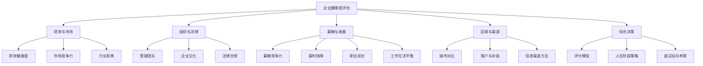

---
tags:
  - 求职
  - 企业评估
  - 方法论
  - 上海
  - 江浙沪
created: 2026-06-12
---

# 企业健康度评估框架总览

## 为什么需要系统化评估？

求职者在面对offer时，往往依赖直觉或零散信息做决策。一个系统化的评估框架可以帮助你：

- **全面覆盖**：不遗漏关键风险信号
- **可量化对比**：多个offer之间公平比较
- **避免认知偏差**：不被"大厂光环""高薪陷阱"蒙蔽

## 五大评估维度

## 文档导航

| 文档 | 核心内容 | 适用场景 |
|------|---------|---------|
| [[01-财务健康与市场竞争力]] | 财报解读、融资分析、风险信号、行业壁垒、江浙沪产业分布 | 拿到offer前尽调 |
| [[02-组织文化与法律合规]] | 管理层评估、文化甄别、劳动仲裁查询、劳动法权益 | 面试中+入职前 |
| [[03-薪酬福利与职业发展]] | 薪资对比、五险一金、期权评估、职级体系、加班文化解码 | 谈薪阶段 |
| [[04-区域因素与信息渠道]] | 城市对比、落户政策、人才补贴、信息收集渠道大全 | 选址阶段 |
| [[05-综合决策框架]] | 多维度打分模型、人生阶段策略、面试反向考察清单 | 最终决策阶段 |

## 推荐评估流程

### 阶段一：投递前（2-3小时）

1. 确定2-3个目标城市 → 参考 [[04-区域因素与信息渠道#核心城市对比]]
2. 列出目标行业和公司清单
3. 企业信用初筛（天眼查/企查查）→ 参考 [[02-组织文化与法律合规#法律合规风险]]
4. 排除"红旗公司"（大量劳动仲裁、经营异常、失信名单）

### 阶段二：面试前（每家公司1-2小时）

1. 深度财务/融资分析 → 参考 [[01-财务健康与市场竞争力]]
2. 员工口碑调研（脉脉、知乎、看准网）→ 参考 [[02-组织文化与法律合规#企业文化与员工口碑]]
3. 行业地位与增长前景判断 → 参考 [[01-财务健康与市场竞争力#市场竞争分析]]
4. 准备反向考察问题 → 参考 [[05-综合决策框架#面试反向考察清单]]

### 阶段三：面试中

1. 观察办公环境与员工状态
2. 向HR确认薪酬结构与福利细节 → 参考 [[03-薪酬福利与职业发展]]
3. 向直属领导了解团队真实状况
4. 记录所有关键信息（用于后续验证）

### 阶段四：拿到offer后（1-2天）

1. 验证面试中获取的所有信息
2. 使用评分模型横向对比 → 参考 [[05-综合决策框架#多维度评分模型]]
3. 结合人生阶段选择策略 → 参考 [[05-综合决策框架#不同人生阶段策略]]
4. 咨询行业前辈/校友 → 参考 [[04-区域因素与信息渠道#人脉渠道]]
5. 做出最终决策

## 快速检查清单

面试前必做的5件事：

- [ ] 天眼查/企查查：股权结构、劳动仲裁数量、经营异常
- [ ] 国家企业信用信息公示系统：社保缴纳人数（判断真实规模）
- [ ] 中国裁判文书网：搜索"公司名+劳动争议"
- [ ] 脉脉匿名区：搜索公司名+裁员/暴雷/996
- [ ] 巨潮资讯/IT桔子：融资或财报信息

## 核心原则

1. **信息交叉验证**：单一来源不可信，至少3个独立来源
2. **现金流优先于利润**：对于上市公司，经营现金流比净利润更重要
3. **社保人数最诚实**：国家企业信用信息公示系统的社保缴纳人数，比任何PR稿都真实
4. **期权按零估值**：除非Pre-IPO且有明确上市时间表，否则期权预期价值≈0
5. **没有完美公司**：关键是明确你当前阶段的优先级，做出知情决策
